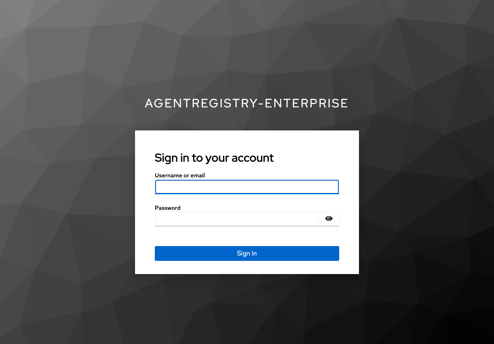
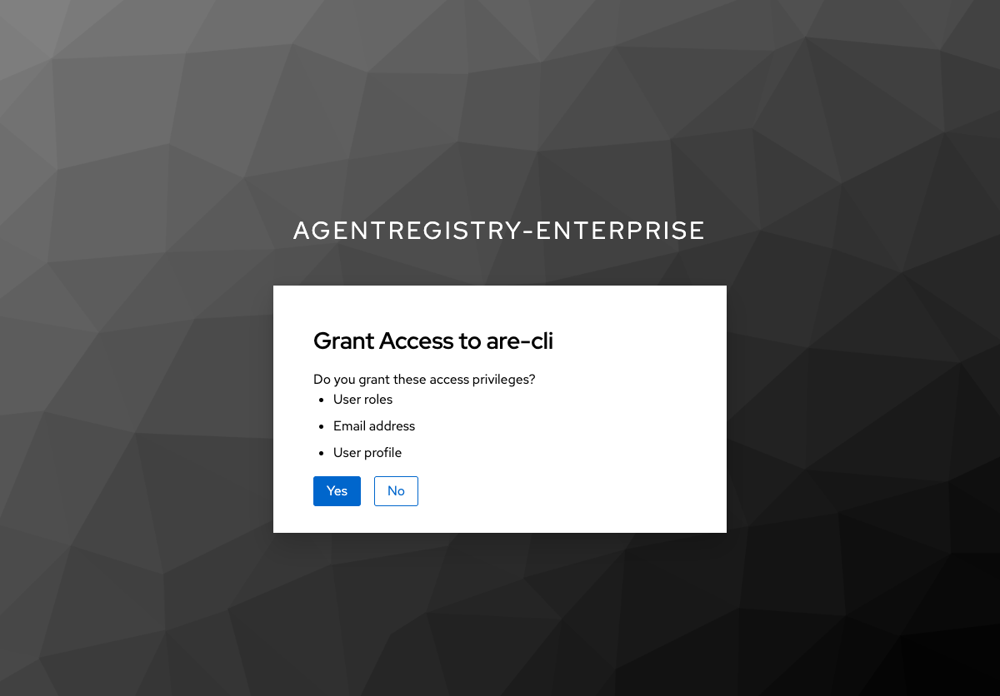
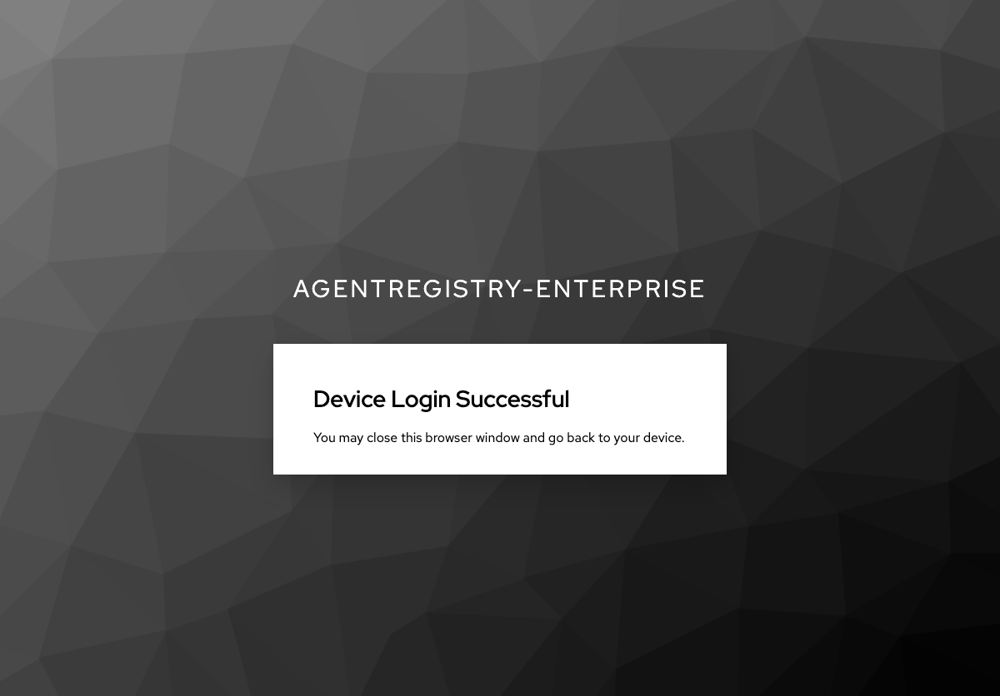
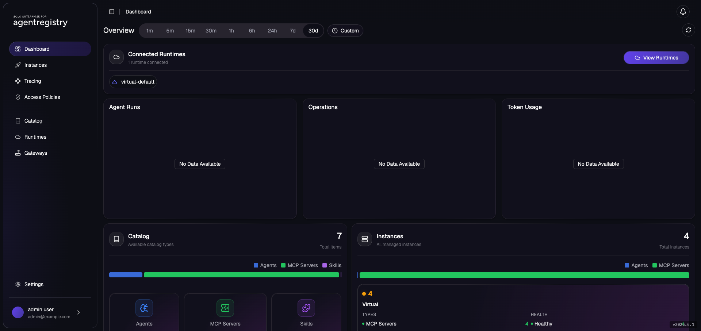

# Install Enterprise Agentregistry

This single lab takes you from a bare Kubernetes cluster to a working **Solo.io Enterprise
Agentregistry** baseline: the `arctl` CLI, an in-cluster OIDC provider (Keycloak), the
Agentregistry control plane + catalog, and Enterprise Agentgateway. Every other lab in this
workshop assumes you've finished this one.

## Lab Objectives

- Confirm cluster prerequisites (Kubernetes ≥ 1.29, default `StorageClass`, working `LoadBalancer`)
- Install the `arctl` CLI
- Stand up Keycloak in-cluster and configure the `agentregistry-enterprise` realm
- Install Agentregistry Enterprise wired to Keycloak OIDC
- Install Enterprise Agentgateway
- Log in with `arctl` and confirm your admin user is recognized

## Pre-requisites

- A running Kubernetes cluster (≥ 1.29) with a default `StorageClass` and a `LoadBalancer`-capable Service controller (managed clusters: yes; bare-metal: MetalLB/kube-vip; `kind`: `cloud-provider-kind`)
- `kubectl`, `helm` v3, `openssl`, `envsubst`, `jq`
- A **Solo trial license key**. Get one free at [solo.io](https://www.solo.io/) or from your Solo account team. Export it as `SOLO_TRIAL_LICENSE_KEY` - the same trial key works for Enterprise Agentgateway.

```bash
export SOLO_TRIAL_LICENSE_KEY=$SOLO_TRIAL_LICENSE_KEY
```

---

## 1. Confirm the Cluster

```bash
kubectl get nodes
kubectl get storageclass
```

You need at least one `StorageClass` marked `(default)` - Agentregistry's bundled PostgreSQL and
ClickHouse both request PVs. If none is default:

```bash
kubectl annotate storageclass <name> storageclass.kubernetes.io/is-default-class=true
```

**Confirm a `LoadBalancer` Service can actually get an external address.** OIDC redirects and the
`arctl`/UI endpoints all depend on this, so test it now rather than discovering it later:

```bash
kubectl create deployment lb-smoke --image=nginx
kubectl expose deployment lb-smoke --port=80 --type=LoadBalancer
kubectl get svc lb-smoke -w
# Wait for EXTERNAL-IP to be populated (not <pending>), then Ctrl-C
kubectl delete deployment lb-smoke && kubectl delete svc lb-smoke
```

If `EXTERNAL-IP` stays `<pending>`, install/fix your LoadBalancer provider before continuing.

---

## 2. Install the `arctl` CLI

```bash
export ARCTL_VERSION=v2026.6.2
curl -sSL https://storage.googleapis.com/agentregistry-enterprise/install.sh \
  | ARCTL_VERSION=$ARCTL_VERSION sh
export PATH=$HOME/.arctl/bin:$PATH
echo 'export PATH="$HOME/.arctl/bin:$PATH"' >> ~/.zshrc   # adjust for bash/fish
```

Verify:

```bash
arctl version --json
```

Expected (server is empty until step 4 - that's fine):

```json
{
  "cli": {
    "version": "v2026.6.2",
    "git_commit": "...",
    "build_time": "..."
  }
}
```

---

## 3. Stand Up Keycloak (OIDC)

Agentregistry Enterprise requires an OIDC provider for login. We run Keycloak in-cluster.

The realm is **fully declarative**: [`assets/keycloak/agentregistry-enterprise.json`](assets/keycloak/agentregistry-enterprise.json)
defines the `agentregistry-enterprise` realm, three groups (`are-admins` / `are-readers` /
`are-writers`), three users (`admin` / `reader` / `writer`, password = username), the two OIDC
clients (`are-backend` confidential with a baked-in secret, `are-cli` public + device-code), and the
`groups` claim mapper on **both** clients. Keycloak imports it on first boot (`--import-realm`), so
there's no admin REST script and nothing to re-run.

Apply the whole stack - namespace, realm ConfigMap, Deployment, and Service - in one command
(Kustomize builds the realm ConfigMap from the JSON above):

```bash
kubectl apply -k assets/keycloak/
kubectl rollout status deployment/keycloak -n keycloak
```

> **Why the `groups` mapper is on `are-cli` too:** `arctl` and the UI both log in through the
> **public `are-cli`** client. If the `groups` mapper only existed on `are-backend`, the token they
> carry would have no `groups` claim, the registry would resolve zero roles, and your `admin` user
> would never be a superuser. The realm JSON puts the mapper on both clients so admin works out of
> the box.

Wait for the LoadBalancer to get an external address, then capture it:

```bash
kubectl get svc keycloak -n keycloak -w
# Wait for EXTERNAL-IP, then Ctrl-C

export KC_IP=$(kubectl get svc keycloak -n keycloak \
  -o jsonpath='{.status.loadBalancer.ingress[0].ip}{.status.loadBalancer.ingress[0].hostname}')
echo "Keycloak: http://${KC_IP}:8080  (admin / admin123)"
```

> **No hostname pinning needed.** Keycloak runs with `hostname-strict=false`, so it derives its
> issuer URL from the request host. Because `arctl`, the browser, and the in-cluster registry all
> reach Keycloak through this same `KC_IP` (the one you put in `OIDC_ISSUER` below), the issuer stays
> consistent - no `kubectl set env` + second rollout.
>
> _Fallback:_ if a device-login URL ever comes back malformed on your cluster, pin the hostname once
> and roll forward:
> ```bash
> kubectl set env deployment/keycloak -n keycloak \
>   KC_HOSTNAME_URL=http://${KC_IP}:8080 KC_HOSTNAME_ADMIN_URL=http://${KC_IP}:8080
> kubectl rollout status deployment/keycloak -n keycloak
> ```

Write the OIDC variables the rest of the install (and every later lab) consumes. Every value except
the issuer is a constant baked into the realm JSON - the group IDs are the fixed UUIDs from the realm,
and `BACKEND_CLIENT_SECRET` is the `are-backend` secret from the same file:

```bash
cat > ~/.are-keycloak-env <<EOF
export OIDC_PROVIDER=keycloak
export OIDC_ISSUER="http://${KC_IP}:8080/realms/agentregistry-enterprise"
export OIDC_BACKEND=are-backend
export OIDC_PUBLIC_CLIENT=are-cli
export ARE_CLI_CLIENT_ID=are-cli
export BACKEND_CLIENT_SECRET="aRe3nt3rpr1seWorkshopBackendSecret"
export GROUP_ADMINS="00000000-0000-0000-0000-00000000a001"
export GROUP_READERS="00000000-0000-0000-0000-00000000a002"
export GROUP_WRITERS="00000000-0000-0000-0000-00000000a003"
EOF
source ~/.are-keycloak-env
```

**Verify the `groups` claim is present on an `are-cli` token** (this is the token `arctl`/UI use -
verifying only `are-backend` would hide problems):

```bash
curl -s -X POST "http://${KC_IP}:8080/realms/agentregistry-enterprise/protocol/openid-connect/token" \
  -d grant_type=password -d client_id=are-cli \
  -d username=admin -d password=admin -d "scope=openid profile" \
  | jq -r .access_token | cut -d. -f2 \
  | base64 -d 2>/dev/null | jq '{preferred_username, groups}'
```

Expected (note: the claim is the plain group **name**, no `/` prefix):

```json
{
  "preferred_username": "admin",
  "groups": ["are-admins"]
}
```

| Username | Password | Group | Role |
|---|---|---|---|
| admin  | admin  | are-admins  | superuser |
| reader | reader | are-readers | read-only |
| writer | writer | are-writers | publish/edit |

---

## 4. Install Agentregistry Enterprise

> [!NOTE]
> **Air-gapped or private-registry install?** This lab pulls images from public registries and
> downloads the `arctl` CLI and backend binaries from `storage.googleapis.com`. For the full set of
> artifacts to mirror, see the [image list](labs/installation/image-list.md). To install with every
> image and binary pointed at a private registry / internal artifact host, follow the dedicated
> [air-gap install lab](labs/installation/airgap/001-airgap.md) instead.

Build the Helm values from your sourced OIDC variables. `superuserRole: are-admins` matches the
group **name** in the `groups` claim (Keycloak emits names, not GUIDs).

```bash
cat > /tmp/are-values.yaml <<EOF
image:
  tag: v2026.6.2
service:
  type: LoadBalancer
oidc:
  issuer: "${OIDC_ISSUER}"
  clientId: "${OIDC_BACKEND}"
  publicClientId: "${OIDC_PUBLIC_CLIENT}"
  clientSecret: "${BACKEND_CLIENT_SECRET}"
  roleClaim: "groups"
  superuserRole: "are-admins"
  insecureSkipVerify: false
database:
  postgres:
    type: bundled
clickhouse:
  enabled: true
telemetry:
  enabled: true
extraEnvVars:
  - name: OTEL_EXPORTER_OTLP_ENDPOINT
    value: "http://agentregistry-enterprise-telemetry-collector:4317"
  - name: OTEL_SERVICE_NAME
    value: "agentregistry-enterprise"
EOF

helm upgrade --install agentregistry-enterprise \
  oci://us-docker.pkg.dev/solo-public/agentregistry-enterprise/helm/agentregistry-enterprise \
  --version 2026.6.2 \
  --namespace agentregistry-system \
  -f /tmp/are-values.yaml \
  --wait --timeout 5m
```

> **Re-running against an existing install?** On a fresh cluster you can skip this. But if the
> registry is already installed and you re-ran step 3 (e.g. you tore down and recreated Keycloak, so
> `BACKEND_CLIENT_SECRET` or `OIDC_ISSUER` changed), `helm upgrade` updates the OIDC `Secret` but the
> running server pod still holds the **old** value in memory - a `Secret` change alone doesn't restart
> it. Force a rollout so it reloads, then re-verify:
> ```bash
> kubectl rollout restart deployment/agentregistry-enterprise-server -n agentregistry-system
> kubectl rollout status  deployment/agentregistry-enterprise-server -n agentregistry-system
> ```
> Symptom if you skip this: `arctl user login` succeeds at Keycloak, but registry calls fail auth
> because the server is validating against stale OIDC config.

Verify all pods are `1/1 Running`:

```bash
kubectl get pods -n agentregistry-system
```

Expected:

```
NAME                                                           READY   STATUS    RESTARTS   AGE
agentregistry-enterprise-clickhouse-shard0-0                   1/1     Running   0          90s
agentregistry-enterprise-postgresql-<hash>                     1/1     Running   0          90s
agentregistry-enterprise-server-<hash>                         1/1     Running   0          90s
agentregistry-enterprise-telemetry-collector-<hash>            1/1     Running   0          90s
```

Grab the external IP and point `arctl` at the server:

```bash
export AR_IP=$(kubectl get svc agentregistry-enterprise-server -n agentregistry-system \
  -o jsonpath='{.status.loadBalancer.ingress[0].ip}{.status.loadBalancer.ingress[0].hostname}')
export ARCTL_API_BASE_URL="http://${AR_IP}:12121"
echo "Agentregistry API + UI: ${ARCTL_API_BASE_URL}"
```

> The LoadBalancer Service is named `agentregistry-enterprise-server` (the chart's post-install
> notes mention a `port-forward` to `svc/agentregistry-enterprise` - that service does **not**
> exist; use `-server` or the LoadBalancer IP above).

---

## 5. Install Enterprise Agentgateway

Required for the MCP-through-gateway lab. Installing it now keeps the baseline complete.

```bash
# Kubernetes Gateway API CRDs
kubectl apply -f https://github.com/kubernetes-sigs/gateway-api/releases/download/v1.5.0/standard-install.yaml

# Agentgateway CRDs
helm upgrade --install agentgateway-crds \
  oci://us-docker.pkg.dev/solo-public/enterprise-agentgateway/charts/enterprise-agentgateway-crds \
  --version v2026.6.1 \
  --namespace agentgateway-system --create-namespace

# Agentgateway controller
helm upgrade --install enterprise-agentgateway \
  oci://us-docker.pkg.dev/solo-public/enterprise-agentgateway/charts/enterprise-agentgateway \
  --version v2026.6.1 \
  --namespace agentgateway-system \
  --set-string licensing.licenseKey="${SOLO_TRIAL_LICENSE_KEY}"
```

Verify the controller is Ready:

```bash
kubectl get pods -n agentgateway-system
```

```
NAME                                       READY   STATUS    RESTARTS   AGE
enterprise-agentgateway-<hash>             1/1     Running   0          30s
```

---

## 6. Authenticate `arctl`

`arctl user login` uses the OIDC **device-authorization** flow: it prints a URL and a code, then
waits. It does **not** auto-open a browser.

```bash
arctl user login \
  --oidc-issuer-url "${OIDC_ISSUER}" \
  --oidc-client-id "${ARE_CLI_CLIENT_ID}"
```

You'll see:

```
To complete the login process, please:
    1. Open: http://<KC_IP>:8080/realms/agentregistry-enterprise/device
    2. Enter the code: XXXX-XXXX
Waiting for authentication...
```

Open that URL in a browser, enter the code, sign in as **`admin` / `admin`**, and approve. The CLI
prints `token stored in keychain successfully`.

The browser walks you through three screens — sign in, grant access to the `are-cli` client, then a
success page you can close:

| 1. Sign in (`admin` / `admin`) | 2. Grant access | 3. Success |
|---|---|---|
|  |  |  |

Confirm the baseline works:

```bash
# 3 built-in runtimes ship out of the box
arctl get runtimes
```

```
NAME                 TYPE
kubernetes-default   Kubernetes
local                Local
virtual-default      Virtual
```

```bash
# both versions now populate
arctl version --json
```

```json
{ "cli": { "version": "v2026.6.2", ... }, "server": { "version": "v2026.6.2", ... } }
```

> **Confirm admin privileges.** Your `admin` user should be a superuser. The most reliable check is
> that admin-only listings succeed:
> ```bash
> arctl get accesspolicies   # should NOT 403 "registry admin required"
> ```
> If this 403s, the `groups` claim isn't reaching the registry. Re-check the `are-cli` token with the
> verification `curl` in step 3 (the realm JSON puts the `groups` mapper on `are-cli`); if the claim is
> missing, `kubectl rollout restart deployment/keycloak -n keycloak` to re-import the realm, then
> `arctl user login` again.

---

## What's in Place After This Lab

| Component | Namespace | Role |
|---|---|---|
| `arctl` CLI | local | Authenticated against your agentregistry server |
| Keycloak | `keycloak` | In-cluster OIDC (realm `agentregistry-enterprise`) |
| Agentregistry Enterprise | `agentregistry-system` | Catalog + control plane |
| Enterprise Agentgateway | `agentgateway-system` | MCP / LLM gateway |

Keep these running for every lab. Each lab returns the cluster to this baseline in its own Cleanup.

### The Agentregistry UI

The registry serves a web UI at the same address as the API (`http://<AR_IP>:12121`). It uses the
same Keycloak SSO you just logged into, so it opens straight to the dashboard. On a fresh baseline
the catalog is empty; as you complete the labs below, the **Catalog**, **Runtimes**, and
**Gateways** pages fill in. After running the MCP and catalog labs it looks like this:



---

## Uninstall

```bash
helm uninstall enterprise-agentgateway -n agentgateway-system 2>/dev/null || true
helm uninstall agentgateway-crds       -n agentgateway-system 2>/dev/null || true
helm uninstall agentregistry-enterprise -n agentregistry-system 2>/dev/null || true
kubectl delete namespace agentgateway-system agentregistry-system keycloak --ignore-not-found
rm -f /tmp/are-values.yaml ~/.are-keycloak-env
# (Optional) remove the Gateway API CRDs if nothing else uses them:
# kubectl delete -f https://github.com/kubernetes-sigs/gateway-api/releases/download/v1.5.0/standard-install.yaml
```

## Next

Start with the recommended first lab:

- [Solo Docs MCP through Agentgateway](labs/mcp/solo-docs-mcp.md)
