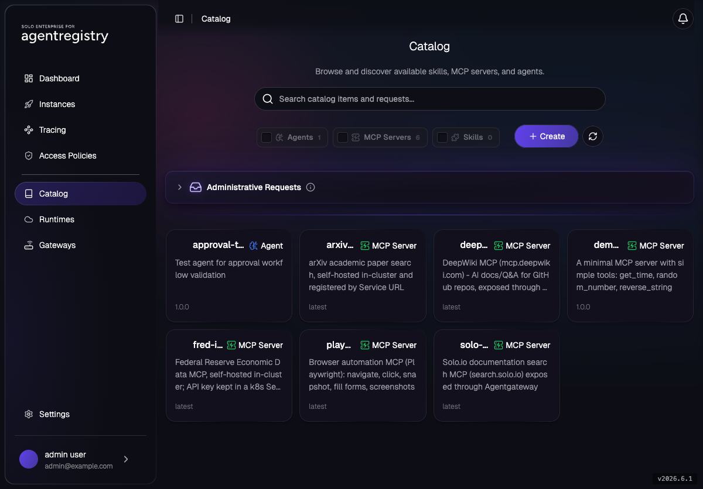
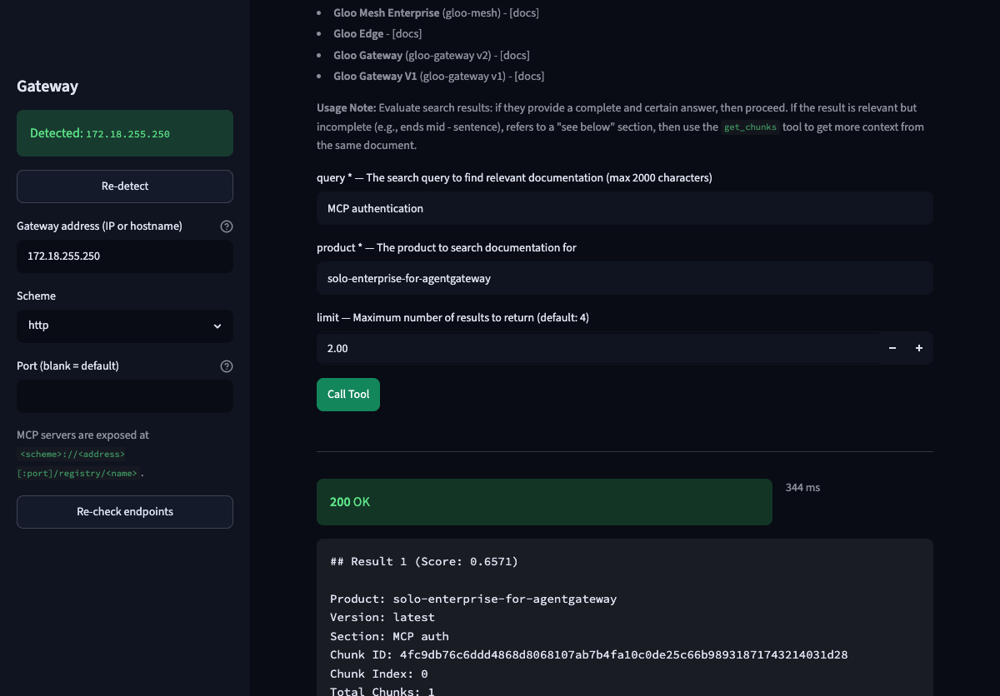

# Enterprise Agentregistry Workshop

As teams adopt AI agents and MCP servers, the building blocks pile up faster than anyone can
govern them — MCP servers, agents, and prompts scattered across repos, wikis, and laptops, each
wired up by hand, with no shared source of truth for what exists, who owns it, or who's allowed
to use it.

**Solo.io Enterprise Agentregistry** brings that sprawl under control. It's a centralized,
Kubernetes-native catalog and control plane for your agentic infrastructure: register MCP servers,
agents, and prompts once as governed catalog assets, expose them through Enterprise Agentgateway at
a single endpoint, and enforce who can discover and submit them with RBAC and approval workflows.
The same `arctl` CLI and `ar.dev/v1alpha1` API drive it whether you're on a laptop or a shared
cluster.

This hands-on workshop takes you from an empty cluster to that fully governed registry. By the end,
you'll have:

- Installed Agentregistry Enterprise on Kubernetes with OIDC login (in-cluster Keycloak)
- Cataloged MCP servers of every shape — local `stdio`, public remote, and self-hosted in-cluster — including ones that need their own API key, kept in a k8s `Secret` and out of the catalog
- Fronted those MCP servers with Enterprise Agentgateway behind a single endpoint, with many backends at distinct paths
- Managed versioned `Prompt` catalog assets independently of agents
- Published versioned `Skill` catalog assets with `arctl init`/`apply`, shipped a second tag, and pulled them as a consumer
- Registered **AWS Bedrock AgentCore** as a cloud `Runtime` and deployed a Bedrock Claude-backed economic research agent to it straight from the catalog
- Locked the catalog down with `AccessPolicy` RBAC and gated submissions behind admin approval workflows



## Prerequisites

- A Kubernetes cluster (≥ 1.29) with a default `StorageClass` and a working `LoadBalancer` Service controller
- `kubectl`, `helm` v3, `openssl`, `envsubst`, `jq`

# Table of Contents

- [Installation](#installation)
- [MCP (Model Context Protocol)](#mcp-model-context-protocol)
- [Catalog](#catalog)
- [Agent Runtimes](#agent-runtimes)
- [Access Control](#access-control)

---

## Installation

> **Start here.** Everything else assumes this baseline.

- [001 — Installation](001-installation.md) — `arctl` + in-cluster Keycloak (OIDC) + Agentregistry Enterprise + Enterprise Agentgateway + login
- [001 — Installation (Air-Gap / Private Registry)](labs/installation/airgap/001-airgap.md) — the same baseline with every image and binary mirrored to a private registry / internal artifact host ([image list](labs/installation/image-list.md))

---

## MCP (Model Context Protocol)

- [Solo.io Docs MCP through Agentgateway](labs/mcp/solo-docs-mcp.md) — **recommended first lab.** Catalog the public `search.solo.io` MCP, expose it through a `Virtual` runtime + Agentgateway, and call its `search` tool end-to-end (no token required)
- [DeepWiki MCP through Agentgateway](labs/mcp/deepwiki-mcp.md) — a second public remote MCP (GitHub-repo Q&A) on the same gateway at its own path (no token)
- [In-Cluster MCP Server (Bring Your Own)](labs/mcp/in-cluster-mcp.md) — self-host an MCP server (`Deployment`+`Service`) and register it by its in-cluster Service URL
- [In-Cluster MCP Server with a Credential (FRED)](labs/mcp/fred-mcp.md) — self-host an MCP server that needs an API key; keep the secret in a k8s `Secret`, out of the catalog
- [Local stdio MCP Server](labs/mcp/local-stdio-mcp.md) — register the in-tree `demo-tools` stdio MCP (Git source; `arctl pull` + run it locally)
- [Playwright Browser MCP](labs/mcp/playwright-mcp.md) — register a **package-based** stdio MCP (npm `@playwright/mcp`) and drive a real headless browser locally
- [MCP Client UI](labs/mcp/mcp-client-ui.md) — a local Streamlit app to call the gateway-fronted MCPs from a browser (live/not-deployed status, Connect, tool dropdowns, gateway logs) instead of hand-written `curl`



## Catalog

- [Prompts](labs/catalog/prompts.md) — `Prompt` CRUD via `arctl` (~5 min)
- [Field RFE Skill](labs/catalog/field-rfe-skill.md) — scaffold a skill with `arctl init skill`, then publish a versioned `Skill` to the catalog with `arctl apply` and ship a second tag (no agent attach) (~8 min)
- [Changelog Skill](labs/catalog/changelog-skill.md) — the same skill flow with the `/changelog` skill: publish, version, and `arctl pull` it as a consumer (~8 min)

## Agent Runtimes

A four-part **AWS Bedrock AgentCore** series (requires an AWS account you can administer):

- [Part 1 — Integrate Agentregistry and AgentCore](labs/runtimes/agentcore-01-integration.md) — build the AWS side from zero (CLI, operator auth, Bedrock model availability), grant the registry AWS access, generate the cross-account IAM role via `arctl runtime setup` + CloudFormation, and register the `agentcore` Runtime
- [Part 2 — Create Agents](labs/runtimes/agentcore-02-create-agents.md) — how the four vertical-use-case agents were built: the `arctl init agent` ADK/Bedrock scaffold, one customized `agent.py` (snapshot data + function tools + grounding instruction), and the Git-sourced catalog entry — all four already checked in under `assets/agents/` (no AWS needed)
- [Part 3 — Register and Deploy Agents to AgentCore](labs/runtimes/agentcore-03-deploy-agents.md) — publish `econresearch` (a Bedrock Claude-backed economic research agent) to the catalog, deploy it to AgentCore, chat from the UI and tail CloudWatch — then deploy [`claimsupport`](assets/agents/claimsupport/), [`bankingsupport`](assets/agents/bankingsupport/), and [`ithelpdesk`](assets/agents/ithelpdesk/) the same way
- [Part 4 — LLM and MCP Through Agentgateway](labs/runtimes/agentcore-04-agentgateway-llm-mcp.md) — extend `econresearch` into [`econresearch-agw`](assets/agents/econresearch-agw/): OpenAI (`gpt-5.4-nano`) LLM calls through an Agentgateway `/openai` route (key held in a k8s Secret at the gateway) and live FRED data via the FRED MCP server at `/registry/fred`, both planes on one gateway (requires a publicly reachable gateway LB)
- [Cleanup](labs/runtimes/agentcore-cleanup.md) — consolidated teardown for all four parts, in dependency order (deployments/catalog entries first, the AWS/IAM integration last)

## Access Control

- [Overview — What the Registry Governs](labs/access-control/README.md) — the governance surface (RBAC, approvals, identity) and where the Registry's scope ends and model/AI governance begins
- [AccessPolicy / RBAC](labs/access-control/access-policies.md) — grant a non-admin group catalog read access; prove it with the `reader` user
- [Approval Workflows](labs/access-control/approval-workflows.md) — gate every catalog submission behind admin approval (`requireCreateApproval`)

---

# Use Cases

- Install Agentregistry Enterprise on Kubernetes with OIDC (in-cluster Keycloak)
- Register MCP servers as catalog assets — `stdio` (local, in-tree), public `streamable-http` (remote), and self-hosted in-cluster servers (registered by Service URL), including servers that need their own API key (kept in a k8s `Secret`, out of the catalog)
- Expose remote and in-cluster MCP servers through Enterprise Agentgateway via a `Virtual` runtime — one gateway endpoint, many backends at distinct paths, with gateway-managed TLS to the upstream
- Manage versioned `Prompt` catalog assets independently of agents
- Publish versioned `Skill` catalog assets (`arctl init`/`apply`), ship a second tag, and `arctl pull` them as a consumer
- Register AWS Bedrock AgentCore as a cloud `Runtime` and deploy catalog `Agent`s to it — registry-built image from Git source, verified in the UI and CloudWatch; four example agents ship in the catalog (`econresearch`, `claimsupport`, `bankingsupport`, `ithelpdesk`) covering FSI research, insurance, banking, and IT helpdesk use cases
- Enforce catalog RBAC with `AccessPolicy` against Keycloak group names
- Gate catalog submissions behind admin approval and approve/reject via the `/v0/approve` API

## Repo Layout

```
fe-enterprise-agentregistry-workshop/
├── README.md
├── 001-installation.md                  # full baseline in one lab
├── labs/
│   ├── installation/
│   │   ├── image-list.md               # every image + binary to mirror for air-gap
│   │   ├── mirror-images.sh            # mirror images + charts to your registry (multi-arch)
│   │   └── airgap/
│   │       ├── 001-airgap.md           # air-gapped baseline (private registry + internal artifact host)
│   │       └── ably7-image-list.md     # illustrative mirrored-tag view
│   ├── mcp/
│   │   ├── solo-docs-mcp.md             # remote MCP through Agentgateway (start here)
│   │   ├── deepwiki-mcp.md              # second remote MCP, same gateway
│   │   ├── in-cluster-mcp.md            # self-hosted MCP server, registered by Service URL
│   │   ├── local-stdio-mcp.md           # in-tree stdio MCP (Git source)
│   │   ├── playwright-mcp.md            # package-based stdio MCP (npm @playwright/mcp)
│   │   └── mcp-client-ui.md             # local Streamlit client for the gateway MCPs
│   ├── catalog/
│   │   ├── prompts.md
│   │   ├── field-rfe-skill.md         # Skill catalog asset (field-rfe example)
│   │   └── changelog-skill.md         # Skill catalog asset (/changelog example)
│   ├── runtimes/
│   │   ├── agentcore-01-integration.md   # wire the registry to AWS + register the Runtime
│   │   ├── agentcore-02-create-agents.md # how the ADK/Bedrock example agents were built
│   │   ├── agentcore-03-deploy-agents.md # publish + deploy to AgentCore, chat, CloudWatch
│   │   ├── agentcore-04-agentgateway-llm-mcp.md # LLM + FRED MCP through Agentgateway
│   │   └── agentcore-cleanup.md          # consolidated teardown for all four parts
│   └── access-control/
│       ├── access-policies.md
│       └── approval-workflows.md
├── assets/
│   ├── keycloak/                        # kustomize stack: deployment + agentregistry-enterprise.json (--import-realm)
│   ├── prompts/                         # Prompt manifest
│   ├── skills/                          # field-rfe + changelog SKILL.md (publishable skill sources)
│   ├── agents/                          # four ADK/Bedrock example agents (Git source):
│   │   └── ...                          #   econresearch, claimsupport, bankingsupport, ithelpdesk
│   ├── runtimes/
│   │   └── agentcore/                   # IAM policies for the registry's AWS access
│   └── mcp/
│       ├── demo-mcp/                    # stdio MCP source (server.py) + manifest
│       ├── playwright/                  # package-based (npm) stdio MCP manifest
│       ├── in-cluster/                  # self-hosted arXiv + FRED MCP: Deployment/Service + catalog/deploy
│       └── agentgateway/                # parent Gateway/Route + Solo Docs & DeepWiki catalog/deploy
├── mcp-client/                          # local Streamlit MCP client (./run.sh) for the gateway MCPs
└── e2e-test.sh                          # end-to-end test: install baseline + every lab, with pass/fail
```

## Validated On

- Agentregistry Enterprise + `arctl` `v2026.6.2`
- Enterprise Agentgateway `v2026.6.1`
- Keycloak `quay.io/keycloak/keycloak:26.0`
- Kubernetes 1.29+
