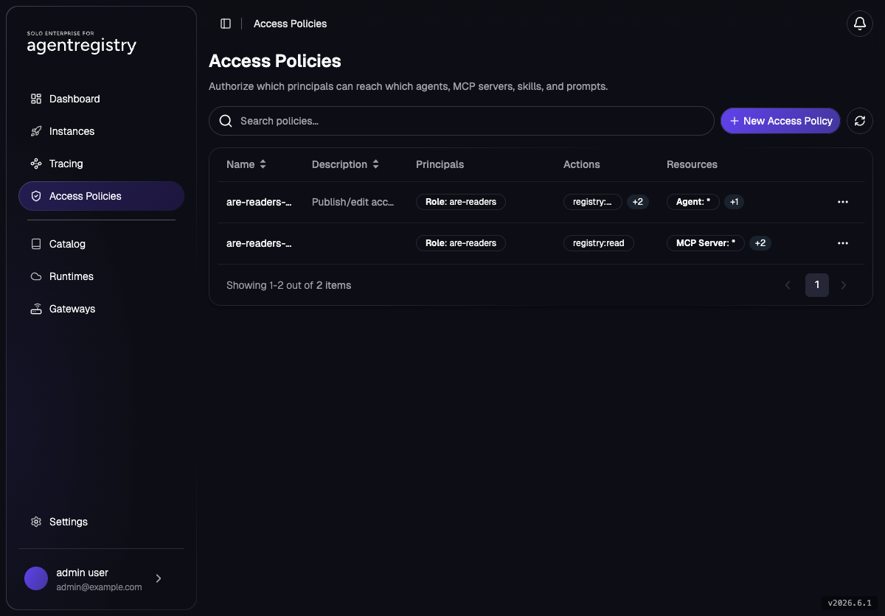

# AccessPolicy — RBAC for the Catalog

Agentregistry Enterprise enforces RBAC with `AccessPolicy` resources that map an OIDC principal (a
Keycloak group, an Entra group object ID, or a `Deployment` identity) to a set of actions on catalog
resources. This lab grants a non-admin group catalog read access and proves it works.

## Lab Objectives

- Understand the `registry:*` action family
- Grant the `are-readers` group `registry:read`
- Prove it with the `reader` user (who is **not** a superuser)
- See why the principal must be the Keycloak group **name**, not its GUID

## Pre-requisites

- [001 - Installation](../../001-installation.md) complete
- At least one catalog asset to see. Register the demo MCP first if you haven't:
  [Local stdio MCP](../mcp/local-stdio-mcp.md) (`arctl apply -f assets/mcp/demo-mcp/mcpserver.yaml`)
- Shell context:

```bash
export PATH=$HOME/.arctl/bin:$PATH
source ~/.are-keycloak-env
export AR_IP=$(kubectl get svc agentregistry-enterprise-server -n agentregistry-system \
  -o jsonpath='{.status.loadBalancer.ingress[0].ip}{.status.loadBalancer.ingress[0].hostname}')
export ARCTL_API_BASE_URL="http://${AR_IP}:12121"
export KC_IP=$(kubectl get svc keycloak -n keycloak \
  -o jsonpath='{.status.loadBalancer.ingress[0].ip}{.status.loadBalancer.ingress[0].hostname}')
```

## The Action Model

| Scope | Used for |
|---|---|
| `registry:read` | List/get filtering - lets a principal **see** matching catalog resources |
| `registry:publish` | Create/submit new catalog assets |
| `registry:edit` | Modify existing catalog assets |

> **Principals must match the role the registry resolves from the token.** With Keycloak, the
> `groups` claim carries the plain group **name** (`are-readers`), so your `AccessPolicy` `Role`
> principal must be `are-readers` - **not** the group's GUID. A policy that uses the GUID is accepted
> and listed, but silently matches nothing.

## 1. Baseline — `reader` Sees Nothing

`reader` is in `are-readers` (not a superuser, no policy yet). Act as `reader` non-interactively by
putting their token in `ARCTL_API_TOKEN`:

```bash
reader_token() {
  curl -s -X POST "http://${KC_IP}:8080/realms/agentregistry-enterprise/protocol/openid-connect/token" \
    -d grant_type=password -d client_id=are-cli \
    -d username=reader -d password=reader -d "scope=openid profile" | jq -r .access_token
}

ARCTL_API_TOKEN=$(reader_token) arctl get mcps
```

```
No mcps found.
```

## 2. Grant `are-readers` Catalog Read

Note the `Role` principal is the group **name**:

```bash
arctl apply -f - <<EOF
apiVersion: ar.dev/v1alpha1
kind: AccessPolicy
metadata:
  name: are-readers-read-catalog
spec:
  description: "Catalog read access for the are-readers group"
  principals:
    - kind: Role
      name: "are-readers"
  rules:
    - actions:
        - "registry:read"
      resources:
        - kind: server
          name: "*"
        - kind: prompt
          name: "*"
        - kind: skill
          name: "*"
EOF
```

## 3. Prove It

```bash
ARCTL_API_TOKEN=$(reader_token) arctl get mcps
```

`reader` now sees the catalog servers:

```
NAME         TAG     DESCRIPTION
demo-tools   1.0.0   A minimal MCP server with simple tools: get_time, random_...
```

List the policy as admin:

```bash
arctl get accesspolicies
```

Admins can also review policies on the **Access Policies** page of the Agentregistry UI:



## 4. (Optional) See the GUID Trap

Re-create the same policy but with the group **GUID** instead of the name, and watch `reader` lose
visibility - the GUID principal matches nothing:

```bash
arctl delete accesspolicy are-readers-read-catalog
arctl apply -f - <<EOF
apiVersion: ar.dev/v1alpha1
kind: AccessPolicy
metadata:
  name: are-readers-read-catalog
spec:
  principals:
    - kind: Role
      name: "${GROUP_READERS}"   # a GUID - WRONG for Keycloak
  rules:
    - actions: ["registry:read"]
      resources:
        - kind: server
          name: "*"
EOF

ARCTL_API_TOKEN=$(reader_token) arctl get mcps   # → No mcps found.
```

Restore the correct (name-based) policy before moving on:

```bash
arctl apply -f - <<EOF
apiVersion: ar.dev/v1alpha1
kind: AccessPolicy
metadata:
  name: are-readers-read-catalog
spec:
  principals:
    - kind: Role
      name: "are-readers"
  rules:
    - actions: ["registry:read"]
      resources:
        - kind: server
          name: "*"
        - kind: prompt
          name: "*"
        - kind: skill
          name: "*"
EOF
```

## Choosing a Principal Kind

| Principal | When to use it |
|---|---|
| `Role` | A user authenticates via OIDC and their token carries a group/role claim. For Keycloak the `name` is the group **name** (`are-readers`); for Entra it's the group object ID. |
| `Deployment` | The caller is a deployed agent acting on its own behalf. The `name` is the agentregistry `Deployment` name. |

## Cleanup

```bash
arctl delete accesspolicy are-readers-read-catalog 2>/dev/null || true
```

## Next

- [Approval Workflows](approval-workflows.md) - gate every catalog submission behind admin approval
