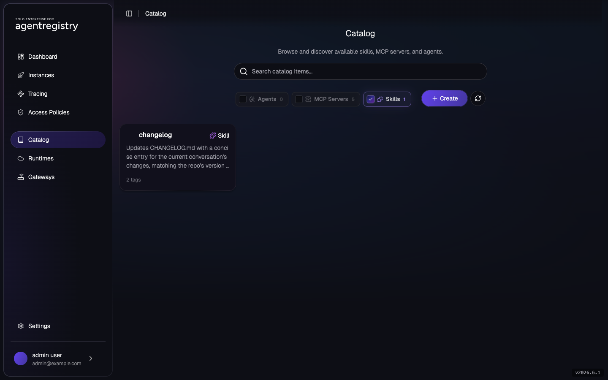
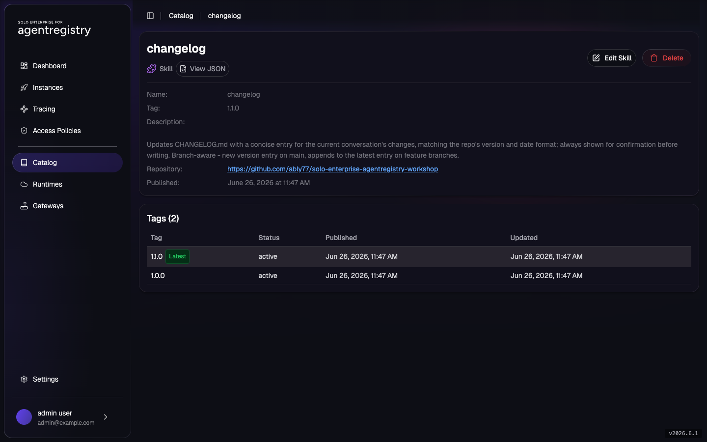

# Changelog Skill

You wrote yourself a small `/changelog` skill: when you invoke it, it reads the conversation, drafts a
concise `CHANGELOG.md` entry in your repo's existing format, and shows it to you before writing. It
started life as a single markdown file in `~/.claude/` on your laptop. It's handy, and now the rest of
the team wants the same thing — but emailing the file around means copies drift, nobody knows which one
is current, and a fix has to be chased down across everyone who has it. Instead you publish the skill
once to the Agentregistry catalog, version it, and let teammates pull it on demand.

This lab walks that path end to end with the `changelog` skill: scaffold and inspect a skill project,
publish it to the catalog, release a second version, and pull it back down as a consumer.

`Skill` is an Agentregistry catalog asset like `Agent`, `MCPServer`, and `Prompt`. You manage skills
declaratively with `arctl` (`init` then `apply`). A skill is a small project: a `skill.yaml` catalog
manifest (`ar.dev/v1alpha1`, `kind: Skill`) and a `SKILL.md` file with YAML frontmatter plus a markdown
body of instructions an agent loads at runtime.

> Prefer the customer-RFE example? [Field RFE Skill](field-rfe-skill.md) runs the same flow with the `field-rfe` skill.
> This lab is self-contained — do either or both.

## Lab Objectives

- Scaffold a skill project with `arctl init skill` and review its layout
- See what `SKILL.md` and `skill.yaml` each contribute
- List skills in the catalog
- Publish the `changelog` skill (metadata plus a `source.repository` reference) with `arctl apply`, and verify it with `arctl get` and the UI
- Release a second version as a new tag and confirm both tags coexist
- Pull the skill's source as a consumer with `arctl pull`
- Delete the skill

## Pre-requisites

- [001 - Installation](../../001-installation.md) complete
- Shell context:

```bash
export PATH=$HOME/.arctl/bin:$PATH
source ~/.are-keycloak-env
export AR_IP=$(kubectl get svc agentregistry-enterprise-server -n agentregistry-system \
  -o jsonpath='{.status.loadBalancer.ingress[0].ip}{.status.loadBalancer.ingress[0].hostname}')
export ARCTL_API_BASE_URL="http://${AR_IP}:12121"
```

## 1. Scaffold a Skill Project

Every skill is a project directory with the same layout. `arctl init skill` generates one. Run it in a
scratch directory to see the structure before publishing the real skill:

```bash
arctl init skill demo-skill --description "Throwaway scaffold to inspect skill project layout"
ls demo-skill
```

Expected:

```
✓ Created skill: demo-skill

🚀 Next steps:
  1. Edit demo-skill/SKILL.md and references/ (optional)
  2. Publish to the registry:
     arctl apply -f demo-skill/skill.yaml
```

```
LICENSE.txt  SKILL.md  assets  references  scripts  skill.yaml
```

| File / dir | What it's for |
|---|---|
| `skill.yaml` | The catalog manifest (`ar.dev/v1alpha1`, `kind: Skill`): name, tag, title, description. This is what `arctl apply` publishes. |
| `SKILL.md` | The skill itself: YAML frontmatter (`name`, `description`) plus a markdown body of instructions an agent loads at runtime. |
| `scripts/`, `assets/`, `references/` | Optional supporting files the skill bundles (helper scripts, static assets, reference docs). |
| `LICENSE.txt` | License for the skill. |

Delete the scaffold. The next step publishes a pre-authored skill instead:

```bash
rm -rf demo-skill
```

## 2. Inspect the changelog Skill

This repo includes the `changelog` skill at
[`assets/skills/changelog/`](../../assets/skills/changelog/), standing in for the file on your laptop.
Look at both files:

```bash
cat assets/skills/changelog/skill.yaml
cat assets/skills/changelog/SKILL.md
```

The `skill.yaml` is the catalog manifest:

```yaml
apiVersion: ar.dev/v1alpha1
kind: Skill
metadata:
  name: changelog
  tag: "1.0.0"
spec:
  title: Changelog
  description: Updates CHANGELOG.md with a concise entry for the current conversation's changes ...
  source:
    repository:
      url: "https://github.com/ably77/solo-enterprise-agentregistry-workshop"
      subfolder: "assets/skills/changelog"
```

- `metadata.name` is the catalog identifier (shown in `arctl get skills`).
- `metadata.tag` is the version. If you omit it, the skill publishes as `latest`.
- `spec.title` and `spec.description` are what the registry listing and UI display.
- `spec.source.repository` is where the skill's content lives. The catalog stores this reference, not
  the `SKILL.md` body. Consumers fetch the content with `arctl pull` (step 7).

The `SKILL.md` frontmatter `description` is the part an agent reads to decide *when* to use the skill;
the markdown body is the *how*. For `changelog`, the body is the step-by-step it follows: check that a
`CHANGELOG.md` exists, read its format, branch on `main` vs. a feature branch, draft bullets from the
conversation, and confirm before writing.

The catalog is a reference catalog. Publishing registers the skill's metadata plus a pointer to its
source, so the registry stays a lightweight index while the content stays in one place (here, this Git
repo). That is why the UI shows the manifest and a `Repository` link instead of rendering the full
`SKILL.md`, and why a consumer pulls the source to read or run it.

## 3. List Skills

Check what the catalog holds before publishing:

```bash
arctl get skills
```

On a fresh install:

```
No skills found.
```

## 4. Publish the Skill

Preview with `--dry-run`, then apply:

```bash
arctl apply -f assets/skills/changelog/skill.yaml --dry-run
arctl apply -f assets/skills/changelog/skill.yaml
```

Expected:

```
✓ Skill/changelog (1.0.0) dry-run (dry run)
✓ Skill/changelog (1.0.0) created
```

## 5. Verify the Skill

```bash
arctl get skills
arctl get skill changelog --tag "1.0.0" -o yaml
```

```
NAME        TAG     DESCRIPTION
changelog   1.0.0   Updates CHANGELOG.md with a concise entry for the curre...
```

The `-o yaml` output includes the `spec.source.repository` you published, confirming the catalog tracks
where the content lives rather than a copy of it.

Open the [Agentregistry UI](http://localhost:12121/) (or your `$AR_IP` on port `12121`), go to
**Catalog**, and filter to **Skills**. `changelog` is listed with its description and tag count:



## 6. Publish a Second Version

A teammate points out the skill only ever creates a new version entry — fine on `main`, but noisy when
they run it on a feature branch. You update the `SKILL.md` so it branches: a new patch entry on
`main`/`master`, but appends to the latest entry on any other branch. Publish it as a new tag so the
existing `1.0.0` stays unchanged for anyone using it. Apply `1.1.0` (the description reflects the
change):

```bash
arctl apply -f - <<'EOF'
apiVersion: ar.dev/v1alpha1
kind: Skill
metadata:
  name: changelog
  tag: "1.1.0"
spec:
  title: Changelog
  description: Updates CHANGELOG.md with a concise entry for the current conversation's changes, matching the repo's version and date format; always shown for confirmation before writing. Branch-aware - new version entry on main, appends to the latest entry on feature branches.
  source:
    repository:
      url: "https://github.com/ably77/solo-enterprise-agentregistry-workshop"
      subfolder: "assets/skills/changelog"
EOF
```

Expected:

```
✓ Skill/changelog (1.1.0) created
```

List every tag of the skill:

```bash
arctl get skill changelog --all-tags
```

```
NAME        TAG     DESCRIPTION
changelog   1.1.0   Updates CHANGELOG.md with a concise entry for the curre...
changelog   1.0.0   Updates CHANGELOG.md with a concise entry for the curre...
```

The list truncates the description, so both rows look the same here; use `arctl get skill changelog
--tag <tag> -o yaml` or the UI to see each version's full text.

Click into `changelog` in the UI to see both tags. `1.1.0` is marked **Latest**, and `1.0.0` is still
`active`. The detail page also shows the `Repository` link the catalog stored for the source:



Consumers reference a skill by name and tag, so a team on `changelog:1.0.0` keeps that version while
others move to `1.1.0` by changing one reference.

> **Note on tags:** `arctl apply` is an upsert per tag. Re-applying the same tag updates that entry in
> place, so treat each released tag as fixed and publish changes as a new tag. The `latest` tag is a
> moving pointer; pin an explicit version for anything you depend on.

## 7. Pull the Skill as a Consumer

Now act as the teammate who wants the skill on their own machine. They find `changelog` in the catalog,
but the catalog stored a reference, not the content. `arctl pull` clones the skill's
`source.repository` (just the `subfolder`) into a local directory:

```bash
arctl pull skill changelog ./changelog --tag "1.1.0"
ls ./changelog
cat ./changelog/SKILL.md
```

Expected:

```
Cloning https://github.com/ably77/solo-enterprise-agentregistry-workshop into ./changelog
Pulled changelog
```

```
SKILL.md  skill.yaml
```

The teammate now has the full `SKILL.md` locally, including the workflow and rules the catalog listing
only summarized. They can drop it into their agent's skills directory and run `/changelog` themselves.

> **`arctl pull` needs the source to be reachable.** It clones `source.repository.url` and looks for
> `subfolder` on the repo's default branch, so the skill's files must be pushed and public (or
> reachable with your Git credentials). Before this workshop repo's `assets/skills/changelog` is on
> `main`, `pull` reports `subdirectory "assets/skills/changelog" not found`. Point `source.repository`
> at a repo and branch that has the content, or push it first.

## Why a Skill Is a Catalog Asset

| Concern | Skill files copy/pasted into agent repos | `Skill` catalog asset |
|---|---|---|
| Versioning | Tied to whoever copied it last; drifts | Distinct `tag` per version; consumers pin one |
| Reuse | Re-copied into every agent that wants it | Referenced by `name` + `tag` |
| Discovery | Tribal knowledge / grep across repos | Listed by `arctl get skills` and the UI |
| Access control | Implicit, ungoverned | `AccessPolicy` grants `registry:read` / `registry:write` on `skill` |
| Source of truth | Multiple divergent copies | One catalog entry teams reference |

A skill can be a team-local helper one squad shares or an org-wide capability many teams adopt. Either
way it lives in the catalog once, versioned and governed. Org-wide skills are the kind of asset you
gate behind [Approval Workflows](../access-control/approval-workflows.md) and lock down with an
[AccessPolicy](../access-control/access-policies.md).

> **Packaging note:** this lab distributes the skill's content through a Git source
> (`source.repository`) that consumers `arctl pull`. Packaging skill content into a container image is
> not yet supported by `arctl build` (which covers `Agent` and `MCPServer`), so Git is the content path
> for skills in this build. Attaching a pulled skill to an agent is out of scope here.

## Cleanup

```bash
arctl delete skill changelog --all-tags
```

Or delete a single tag:

```bash
arctl delete skill changelog --tag "1.0.0"
```

## Next

- [Field RFE Skill](field-rfe-skill.md) - the same flow with the `field-rfe` customer-RFE skill
- [Prompts](prompts.md) - the inline text catalog asset, also managed with `arctl apply`
- [AccessPolicy / RBAC](../access-control/access-policies.md) - grant `registry:read` on `skill`
- [Approval Workflows](../access-control/approval-workflows.md) - gate catalog submissions behind admin approval
