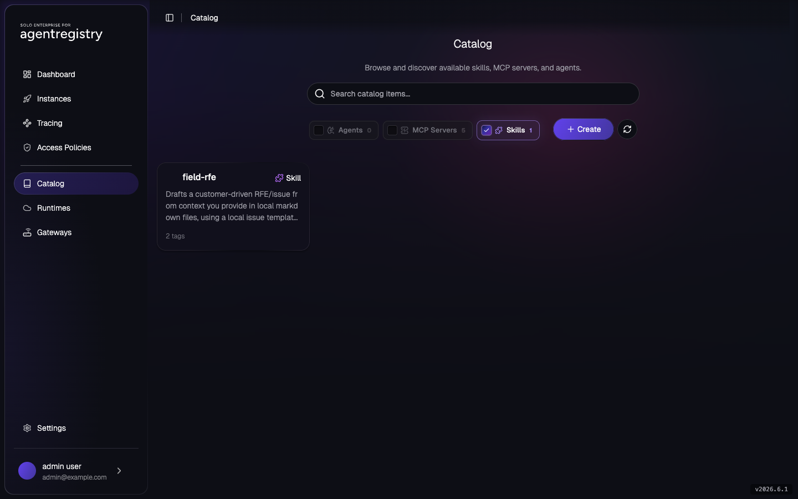
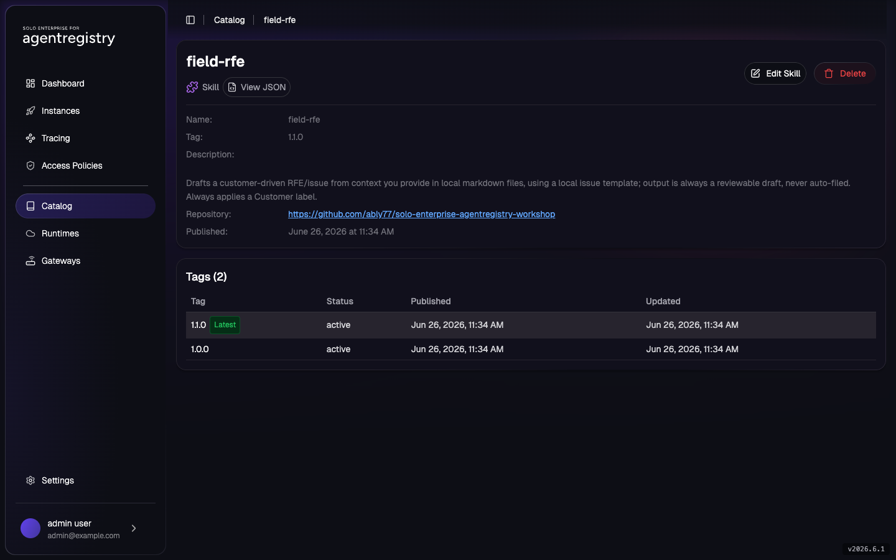

# Field RFE Skill

You built a skill for yourself: [`field-rfe`](../../assets/skills/field-rfe/SKILL.md), which turns
context you drop into local markdown files into a draft RFE issue. It lives in a folder on your laptop,
it works, and now teammates want it too. Passing the folder around by hand doesn't scale: copies drift, nobody
knows which one is current, and fixing a bug means tracking down everyone who has it. Instead you
publish the skill once to the Agentregistry catalog, where the team can find it, pin a version, and
pull it on demand.

This lab covers that path: scaffold and inspect a skill, publish it to the catalog, release a second
version, and pull it back down as a consumer.

`Skill` is an Agentregistry catalog asset like `Agent`, `MCPServer`, and `Prompt`. You manage skills
declaratively with `arctl` (`init` then `apply`). A skill is a small project: a `skill.yaml` catalog
manifest (`ar.dev/v1alpha1`, `kind: Skill`) and a `SKILL.md` file with YAML frontmatter plus a
markdown body of instructions an agent loads at runtime.

## Lab Objectives

- Scaffold a skill project with `arctl init skill` and review its layout
- See what `SKILL.md` and `skill.yaml` each contribute
- List skills in the catalog
- Publish a skill (metadata plus a `source.repository` reference) with `arctl apply`, and verify it with `arctl get` and the UI
- Release a second version as a new tag and confirm both tags coexist
- Pull the skill's source as a consumer with `arctl pull`
- Delete the skill

## Pre-requisites

- [001 - Installation](../../001-installation.md) complete
- Shell context:

```bash
export PATH=$HOME/.arctl/bin:$PATH
source ~/.are-keycloak-env
export AR_IP=$(kubectl get svc agentregistry-enterprise-server -n agentregistry-system \
  -o jsonpath='{.status.loadBalancer.ingress[0].ip}{.status.loadBalancer.ingress[0].hostname}')
export ARCTL_API_BASE_URL="http://${AR_IP}:12121"
```

## 1. Scaffold a Skill Project

Every skill is a project directory with the same layout. `arctl init skill` generates one. Run it in a
scratch directory to see the structure before publishing the real skill:

```bash
arctl init skill demo-skill --description "Throwaway scaffold to inspect skill project layout"
ls demo-skill
```

Expected:

```
✓ Created skill: demo-skill

🚀 Next steps:
  1. Edit demo-skill/SKILL.md and references/ (optional)
  2. Publish to the registry:
     arctl apply -f demo-skill/skill.yaml
```

```
LICENSE.txt  SKILL.md  assets  references  scripts  skill.yaml
```

| File / dir | What it's for |
|---|---|
| `skill.yaml` | The catalog manifest (`ar.dev/v1alpha1`, `kind: Skill`): name, tag, title, description. This is what `arctl apply` publishes. |
| `SKILL.md` | The skill itself: YAML frontmatter (`name`, `description`) plus a markdown body of instructions an agent loads at runtime. |
| `scripts/`, `assets/`, `references/` | Optional supporting files the skill bundles (helper scripts, static assets, reference docs). |
| `LICENSE.txt` | License for the skill. |

Delete the scaffold. The next step publishes a pre-authored skill instead:

```bash
rm -rf demo-skill
```

## 2. Inspect the field-rfe Skill

This repo includes the `field-rfe` skill at
[`assets/skills/field-rfe/`](../../assets/skills/field-rfe/), standing in for the folder on your
laptop. Look at both files:

```bash
cat assets/skills/field-rfe/skill.yaml
cat assets/skills/field-rfe/SKILL.md
```

The `skill.yaml` is the catalog manifest:

```yaml
apiVersion: ar.dev/v1alpha1
kind: Skill
metadata:
  name: field-rfe
  tag: "1.0.0"
spec:
  title: Field RFE Draft
  description: Drafts a customer-driven RFE/issue from context you provide in local markdown files ...
  source:
    repository:
      url: "https://github.com/ably77/solo-enterprise-agentregistry-workshop"
      subfolder: "assets/skills/field-rfe"
```

- `metadata.name` is the catalog identifier (shown in `arctl get skills`).
- `metadata.tag` is the version. If you omit it, the skill publishes as `latest`.
- `spec.title` and `spec.description` are what the registry listing and UI display.
- `spec.source.repository` is where the skill's content lives. The catalog stores this reference, not
  the `SKILL.md` body. Consumers fetch the content with `arctl pull` (step 7).

The catalog is a reference catalog. Publishing registers the skill's metadata plus a pointer to its
source, so the registry stays a lightweight index while the content stays in one place (here, this Git
repo). That is why the UI shows the manifest and a `Repository` link instead of rendering the full
`SKILL.md`, and why a consumer pulls the source to read or run it.

## 3. List Skills

Check what the catalog holds before publishing:

```bash
arctl get skills
```

On a fresh install:

```
No skills found.
```

## 4. Publish the Skill

Preview with `--dry-run`, then apply:

```bash
arctl apply -f assets/skills/field-rfe/skill.yaml --dry-run
arctl apply -f assets/skills/field-rfe/skill.yaml
```

Expected:

```
✓ Skill/field-rfe (1.0.0) dry-run (dry run)
✓ Skill/field-rfe (1.0.0) created
```

## 5. Verify the Skill

```bash
arctl get skills
arctl get skill field-rfe --tag "1.0.0" -o yaml
```

```
NAME        TAG     DESCRIPTION
field-rfe   1.0.0   Drafts a customer-driven RFE/issue from context you provi...
```

The `-o yaml` output includes the `spec.source.repository` you published, confirming the catalog
tracks where the content lives rather than a copy of it.

Open the [Agentregistry UI](http://localhost:12121/) (or your `$AR_IP` on port `12121`), go to
**Catalog**, and filter to **Skills**. `field-rfe` is listed with its description and tag count:



## 6. Publish a Second Version

A teammate asks for a change: the skill should always apply a `Customer:` label. Publish it as a new
tag so the existing `1.0.0` stays unchanged for anyone using it. Apply `1.1.0` (the description
reflects the change):

```bash
arctl apply -f - <<'EOF'
apiVersion: ar.dev/v1alpha1
kind: Skill
metadata:
  name: field-rfe
  tag: "1.1.0"
spec:
  title: Field RFE Draft
  description: Drafts a customer-driven RFE/issue from context you provide in local markdown files, using a local issue template; output is always a reviewable draft, never auto-filed. Always applies a Customer label.
  source:
    repository:
      url: "https://github.com/ably77/solo-enterprise-agentregistry-workshop"
      subfolder: "assets/skills/field-rfe"
EOF
```

Expected:

```
✓ Skill/field-rfe (1.1.0) created
```

List every tag of the skill:

```bash
arctl get skill field-rfe --all-tags
```

```
NAME        TAG     DESCRIPTION
field-rfe   1.1.0   Drafts a customer-driven RFE/issue from context you provi...
field-rfe   1.0.0   Drafts a customer-driven RFE/issue from context you provi...
```

The list truncates the description, so both rows look the same here; use `arctl get skill field-rfe
--tag <tag> -o yaml` or the UI to see each version's full text.

Click into `field-rfe` in the UI to see both tags. `1.1.0` is marked **Latest**, and `1.0.0` is still
`active`. The detail page also shows the `Repository` link the catalog stored for the source:



Consumers reference a skill by name and tag, so a team on `field-rfe:1.0.0` keeps that version while
others move to `1.1.0` by changing one reference.

> **Note on tags:** `arctl apply` is an upsert per tag. Re-applying the same tag updates that entry in
> place, so treat each released tag as fixed and publish changes as a new tag. The `latest` tag is a
> moving pointer; pin an explicit version for anything you depend on.

## 7. Pull the Skill as a Consumer

Now act as the teammate who wants the skill on their own machine. They find `field-rfe` in the catalog,
but the catalog stored a reference, not the content. `arctl pull` clones the skill's
`source.repository` (just the `subfolder`) into a local directory:

```bash
arctl pull skill field-rfe ./field-rfe --tag "1.1.0"
ls ./field-rfe
cat ./field-rfe/SKILL.md
```

Expected:

```
Cloning https://github.com/ably77/solo-enterprise-agentregistry-workshop into ./field-rfe
Pulled field-rfe
```

```
SKILL.md  skill.yaml
```

The teammate now has the full `SKILL.md` locally, including the instructions and rules the catalog
listing only summarized.

> **`arctl pull` needs the source to be reachable.** It clones `source.repository.url` and looks for
> `subfolder` on the repo's default branch, so the skill's files must be pushed and public (or
> reachable with your Git credentials). Before this workshop repo's `assets/skills/field-rfe` is on
> `main`, `pull` reports `subdirectory "assets/skills/field-rfe" not found`. Point `source.repository`
> at a repo and branch that has the content, or push it first.

## Why a Skill Is a Catalog Asset

| Concern | Skill files copy/pasted into agent repos | `Skill` catalog asset |
|---|---|---|
| Versioning | Tied to whoever copied it last; drifts | Distinct `tag` per version; consumers pin one |
| Reuse | Re-copied into every agent that wants it | Referenced by `name` + `tag` |
| Discovery | Tribal knowledge / grep across repos | Listed by `arctl get skills` and the UI |
| Access control | Implicit, ungoverned | `AccessPolicy` grants `registry:read` / `registry:write` on `skill` |
| Source of truth | Multiple divergent copies | One catalog entry teams reference |

A skill can be a team-local helper one squad shares or an org-wide capability many teams adopt. Either
way it lives in the catalog once, versioned and governed. Org-wide skills are the kind of asset you
gate behind [Approval Workflows](../access-control/approval-workflows.md) and lock down with an
[AccessPolicy](../access-control/access-policies.md).

> **Packaging note:** this lab distributes the skill's content through a Git source
> (`source.repository`) that consumers `arctl pull`. Packaging skill content into a container image is
> not yet supported by `arctl build` (which covers `Agent` and `MCPServer`), so Git is the content path
> for skills in this build. Attaching a pulled skill to an agent is out of scope here.

## Cleanup

```bash
arctl delete skill field-rfe --all-tags
```

Or delete a single tag:

```bash
arctl delete skill field-rfe --tag "1.0.0"
```

## Next

- [Changelog Skill](changelog-skill.md) - the same flow with the `/changelog` skill
- [Prompts](prompts.md) - the inline text catalog asset, also managed with `arctl apply`
- [AccessPolicy / RBAC](../access-control/access-policies.md) - grant `registry:read` on `skill`
- [Approval Workflows](../access-control/approval-workflows.md) - gate catalog submissions behind admin approval
