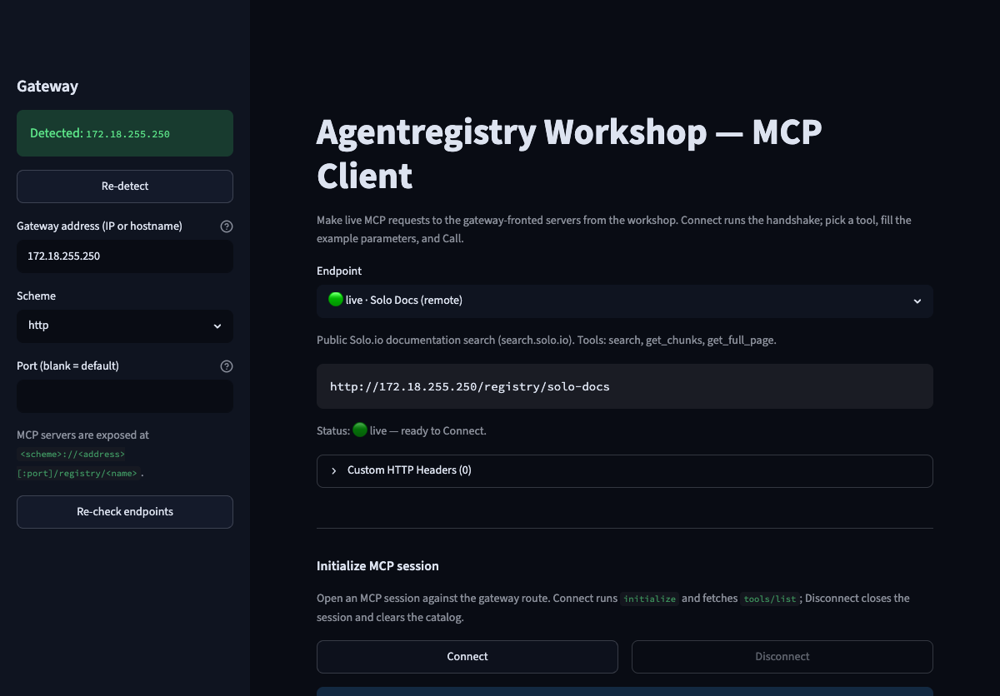
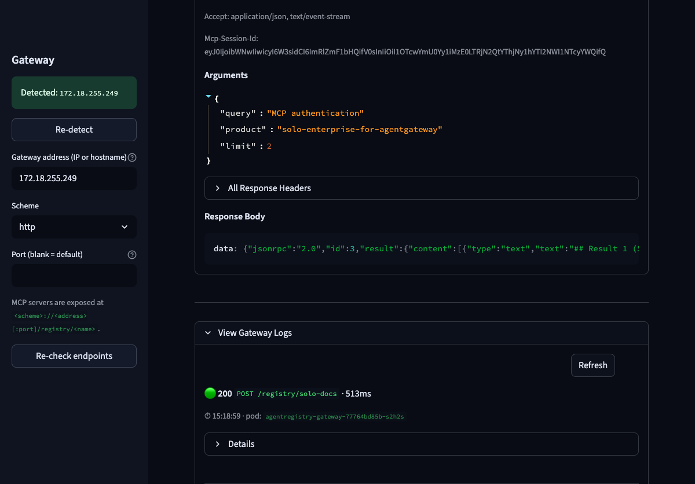

# MCP Client UI (call the gateway from a browser)

The other MCP labs call the gateway-fronted servers with hand-written `curl` — the full
`initialize` → session → `tools/list` → `tools/call` handshake. This lab swaps that for a
small **local web UI** that does the handshake for you: pick an endpoint, **Connect**,
choose a tool from a dropdown, fill the (pre-filled) parameters, **Call**, and watch the
requests land in the **gateway logs**.

It's the same embedded MCP-client widget used by the Enterprise Agentgateway demo UI,
vendored into this repo under [`mcp-client/`](../../mcp-client/) and wrapped with a
workshop-specific endpoint picker. It speaks MCP over Streamable HTTP, so it works against
any `/registry/...` route you've deployed.

## Lab Objectives

- Run a local Streamlit MCP client against the workshop gateway
- See which `/registry/*` endpoints are live vs not deployed
- Connect to a gateway-fronted MCP server and list its tools
- Call a tool from the UI and read the result
- Watch the request in the gateway's logs

## Pre-requisites

- [001 - Installation](../../001-installation.md) complete
- At least one gateway-fronted MCP lab deployed, so a `/registry/<name>` route exists —
  e.g. [Solo Docs MCP](solo-docs-mcp.md) (recommended). The picker also covers
  [DeepWiki](deepwiki-mcp.md), [arXiv](in-cluster-mcp.md), and [FRED](fred-mcp.md).
- `kubectl` pointed at the workshop cluster (used only to auto-detect the gateway address
  and stream its logs — you can also type the address in manually).
- Python 3.9+.

## 1. Launch the Client

```bash
cd mcp-client
./run.sh
# → open http://localhost:8501
```

`run.sh` creates a local `.venv`, installs `streamlit` + `requests`, and starts the app.
Use a different port with `PORT=8600 ./run.sh`.

On launch, the sidebar auto-detects the gateway and each `/registry/*` endpoint is probed and
badged (🟢 live / ⚪ not deployed):



## 2. Confirm the Gateway Address

The **sidebar** auto-detects the gateway address from:

```bash
kubectl -n agentgateway-system get gateway agentregistry-gateway -o jsonpath='{.status.addresses[0].value}'
```

If it shows `Detected: <ip>`, you're set. If detection fails (e.g. `kubectl` isn't
configured on this machine), paste the LoadBalancer IP/hostname into **Gateway address**.
The listener is HTTP/80, so leave **Port** blank.

### Endpoint status badges

The client doesn't assume your endpoints exist — it **probes each one** (a cheap
`initialize`) and labels it in the dropdown:

| Badge | Meaning |
|---|---|
| 🟢 live | Route is up and answered — ready to Connect |
| ⚪ not deployed | Gateway is up but there's no route at this path — deploy it via its lab first |
| 🔴 unreachable | Couldn't reach the gateway address at all — fix the address/LB reachability |
| 🟠 error | Reachable but the upstream MCP server errored |

When the selected endpoint isn't live, the app shows a hint pointing at the lab that
deploys it (e.g. `labs/mcp/solo-docs-mcp.md`). Status is cached per session; click
**Re-check endpoints** in the sidebar after deploying one to refresh.

## 3. Connect and Call a Tool

1. Pick an **Endpoint** — start with **Solo Docs (remote)**. The resolved URL
   (`http://<address>/registry/solo-docs`) is shown for confirmation.
2. Click **Connect**. The client runs `initialize` + `notifications/initialized`, then
   `tools/list`. You'll see `Connected to Solo.io - Docs MCP` and a **Tool** dropdown.
3. The **Tool** dropdown lists `search`, `get_chunks`, `get_full_page`. With `search`
   selected, the parameters are pre-filled with a working example
   (`query: "MCP authentication"`, `product: "solo-enterprise-for-agentgateway"`).
4. Click **Call Tool**. The result renders below (HTTP 200 + the matching Solo.io docs),
   and the call is saved under **Call History** with the request/response headers
   (including the `Mcp-Session-Id`).


Switch the endpoint dropdown to **arXiv** or **FRED** and repeat — each remembers its own
session and history.

## 4. Watch the Gateway Logs

Expand **View Gateway Logs** at the bottom. Each request you made shows as a card:

```
🟢 200  POST /registry/solo-docs · 488ms
⏱ 23:44:15 · pod: agentregistry-gateway-96558f4f4-rz88q
```

The `202`s are the `notifications/initialized` calls; the `200`s are
`initialize`/`tools/list`/`tools/call`. Click **Refresh** after a new call to pull the
latest lines.



## Sending a Caller Credential (optional)

Some MCP endpoints require the *caller* to present an `Authorization` header (distinct
from a server-internal key like [FRED's](fred-mcp.md)). Open the **Custom HTTP Headers**
expander, add `Authorization: Bearer <token>`, and it's sent with every request — toggle
it off to demo a 401/403 vs 200.

## Scope

This client speaks MCP over HTTP, so it only covers the **gateway-fronted** servers
(`/registry/...`). The [`demo-tools` stdio MCP](local-stdio-mcp.md) and the
[`Prompt`](../catalog/prompts.md) asset are **catalog-only** — they have no HTTP endpoint
and are inspected with `arctl get mcps` / `arctl get prompts`, not here.

## Troubleshooting

| Symptom | Fix |
|---|---|
| Sidebar shows "Could not auto-detect" | `kubectl` isn't configured here, or the parent Gateway isn't deployed. Deploy a gateway MCP lab, or type the LB address in manually. |
| `Connect` errors with a connection failure | The gateway address/port is wrong, or the LB IP isn't reachable from this machine. Verify with `curl http://<address>/registry/<name>`. |
| `404` on Connect | That `/registry/<name>` route isn't deployed. Check `arctl get deployments` and the matching MCP lab. |
| Tool list is empty | The upstream MCP server is unreachable from the gateway (in-cluster Service down, or remote upstream blocked). Check the deployment status and gateway logs. |

## Cleanup

Stop the app with `Ctrl-C`. Nothing is installed in the cluster — the client is read-only.
Remove the local virtualenv if you like:

```bash
rm -rf mcp-client/.venv
```

## Next

- [Solo Docs MCP through Agentgateway](solo-docs-mcp.md) / [DeepWiki](deepwiki-mcp.md) — the remote MCPs this client calls
- [AccessPolicy / RBAC](../access-control/access-policies.md)
