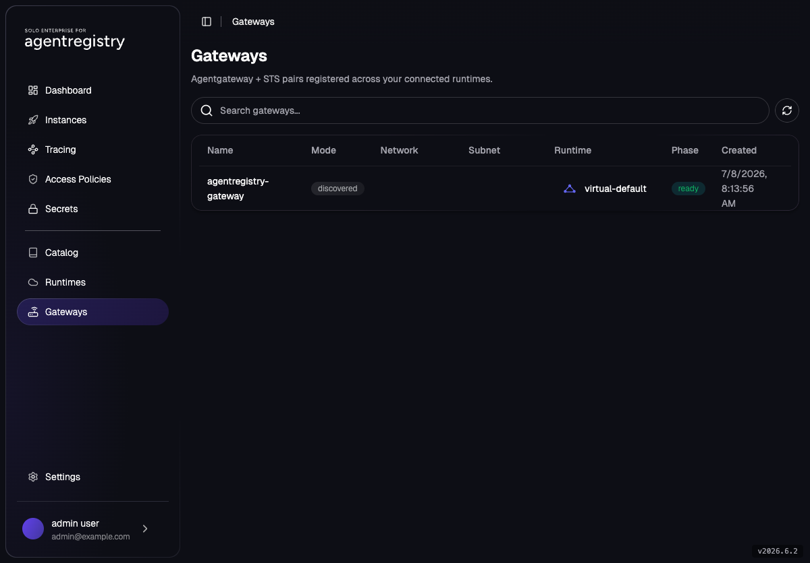
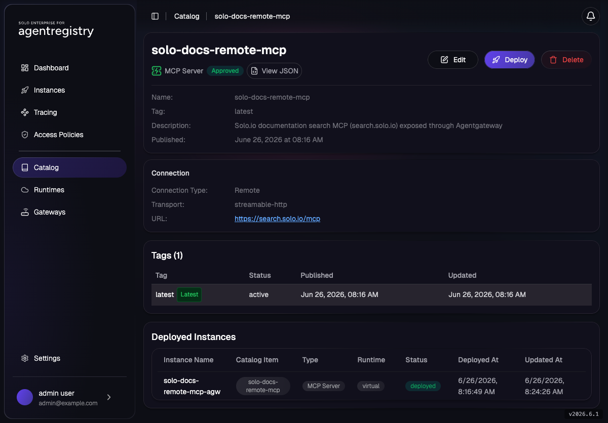

# Solo.io Docs MCP through Agentgateway

Register the **public Solo.io documentation MCP server** (`https://search.solo.io/mcp`) in the
Agentregistry catalog and expose it through Enterprise Agentgateway. Agentregistry catalogs the
server, a `Virtual` runtime Deployment publishes it as a child route on the gateway, and any MCP
client hits `/registry/solo-docs`. The gateway TLS-terminates to `search.solo.io` for you.

Because the upstream is public, this lab needs **no API token** - you run the whole flow,
including a real tool call, with just the baseline.

## Lab Objectives

- Stand up a parent `Gateway` + `HTTPRoute` that delegate `/registry` to agentregistry
- Catalog the Solo.io Docs MCP server (no token)
- Deploy it to the built-in `virtual-default` runtime
- Verify the generated child `HTTPRoute` + `EnterpriseAgentgatewayBackend`
- Hit `/registry/solo-docs` and actually call the `search` tool

## Pre-requisites

- [001 - Installation](../../001-installation.md) complete (Agentregistry + Enterprise Agentgateway)
- Optional: to run this lab's calls from a browser instead of `curl`, use the
  [MCP Client UI](mcp-client-ui.md) and pick the **Solo Docs (remote)** endpoint.
- Your shell context from 001:

```bash
export PATH=$HOME/.arctl/bin:$PATH
source ~/.are-keycloak-env
export AR_IP=$(kubectl get svc agentregistry-enterprise-server -n agentregistry-system \
  -o jsonpath='{.status.loadBalancer.ingress[0].ip}{.status.loadBalancer.ingress[0].hostname}')
export ARCTL_API_BASE_URL="http://${AR_IP}:12121"
```

## Architecture

```
client
  │ MCP request
  ▼
[ Agentgateway Gateway (agentgateway-system) ]
  │ parent HTTPRoute  ──▶  delegates /registry to children
  ▼
[ child HTTPRoute (agentregistry-system) ]   ← created by agentregistry
  │
  │ EnterpriseAgentgatewayBackend            ← created by agentregistry (TLS to upstream)
  ▼
Solo.io Docs MCP (https://search.solo.io/mcp)
```

## 1. Create the Parent Gateway and Route

The `agentregistry.solo.io/runtime: virtual-default` label binds these Kubernetes resources to the
agentregistry `Virtual` runtime.

```bash
cat assets/mcp/agentgateway/parent-gateway-and-route.yaml
kubectl apply -f assets/mcp/agentgateway/parent-gateway-and-route.yaml
```

**Wait for the Gateway to be programmed before you deploy anything to it** (see the gotcha in step 4):

```bash
kubectl -n agentgateway-system get gateway agentregistry-gateway -w
# Wait for PROGRAMMED=True and an ADDRESS, then Ctrl-C
```

```
NAME                    CLASS                     ADDRESS          PROGRAMMED   AGE
agentregistry-gateway   enterprise-agentgateway   172.18.255.250   True         20s
```

## 2. Confirm the `Virtual` Runtime

Agentregistry seeds `virtual-default` on startup:

```bash
arctl get runtime virtual-default -o yaml
```

## 3. Catalog the Solo.io Docs MCP Server

No `envsubst`, no token - the upstream is public:

```bash
cat assets/mcp/agentgateway/solo-docs-remote-mcp.yaml
arctl apply -f assets/mcp/agentgateway/solo-docs-remote-mcp.yaml
```

```
✓ MCPServer/solo-docs-remote-mcp (latest) created
```

The manifest declares `tag: latest`, so verify with `--tag latest`:

```bash
arctl get mcp solo-docs-remote-mcp --tag latest -o yaml
```

## 4. Deploy the MCP to the Virtual Runtime

With `/registry` from the parent route and `pathSuffix: /solo-docs`, the exposed path is
`/registry/solo-docs`:

```bash
cat assets/mcp/agentgateway/solo-docs-remote-mcp-deploy.yaml
arctl apply -f assets/mcp/agentgateway/solo-docs-remote-mcp-deploy.yaml
```

Verify the Deployment:

```bash
arctl get deployment solo-docs-remote-mcp-agw -o yaml
```

Look for `status.conditions[].reason: DeployedViaAgentgateway` (`status: "True"`) and
`status.details.agentgateway.exposedAt[].url: http://<gateway-address>/registry/solo-docs`.

> **(Air-gap) This is the first step that exercises the server-managed backend binaries.** To
> provision this backend the server downloads `agw-sync` / `agentgateway` / `agentregistry-sts` from
> `global.binaryHost` (set during the [air-gap install](../installation/airgap/001-airgap.md)). If the
> Deployment never reaches `DeployedViaAgentgateway` — it stays pending with no clear error — your
> binary host is the prime suspect. Confirm the download succeeded:
> ```bash
> kubectl logs -n agentregistry-system deploy/agentregistry-enterprise-server | grep -i -E "download|agw-sync|agentgateway|sts"
> ```
> A reachable host logs successful downloads; failures show connection/404 errors against your
> `binaryHost`. (On a connected install with `binaryHost=https://storage.googleapis.com` this just
> works.)

> **Ordering gotcha:** if you applied this Deployment *before* the parent Gateway reported
> `PROGRAMMED=True`, it gets stuck with `reason: NoAcceptedListener`. It does **not** self-heal once
> the Gateway is ready, and re-`apply`-ing the identical spec returns `unchanged` without
> re-reconciling. Force it:
> ```bash
> arctl delete deployment solo-docs-remote-mcp-agw
> arctl apply  -f assets/mcp/agentgateway/solo-docs-remote-mcp-deploy.yaml
> ```

## 5. Inspect the Generated Resources

```bash
kubectl -n agentregistry-system get httproutes.gateway.networking.k8s.io
kubectl -n agentregistry-system get enterpriseagentgatewaybackends.enterpriseagentgateway.solo.io
```

You should see a child route `dep-default-solo-docs-remote-mcp-agw-<hash>` and a backend
`mcp-default-solo-docs-remote-mcp` with `ACCEPTED=True`.

The same state is visible in the Agentregistry UI (`http://<AR_IP>:12121`). The **Catalog** page
lists the cataloged MCP server(s), and the **Gateways** page shows `agentregistry-gateway` discovered on the
`virtual-default` runtime:

| Catalog | Gateways |
|---|---|
|  |  |

Click an entry to drill into its detail page. For `solo-docs-remote-mcp` you can see the connection
(Remote · `streamable-http` · `https://search.solo.io/mcp`), every published tag, and the **Deployed
Instances** table showing `solo-docs-remote-mcp-agw` running on the `virtual` runtime:



## 6. Get the Gateway Address

```bash
export AGW_ADDRESS=$(kubectl -n agentgateway-system get gateway agentregistry-gateway \
  -o jsonpath='{.status.addresses[0].value}')
echo "${AGW_ADDRESS}"
```

## 7. Call the Exposed MCP Endpoint

### 7a. `initialize` (transport check)

```bash
curl -s -D - -o /dev/null -X POST \
  -H "Accept: application/json, text/event-stream" \
  -H "Content-Type: application/json" \
  -d '{"jsonrpc":"2.0","id":1,"method":"initialize","params":{"protocolVersion":"2025-06-18","capabilities":{},"clientInfo":{"name":"curl","version":"0.0.1"}}}' \
  "http://${AGW_ADDRESS}/registry/solo-docs" | grep -iE "HTTP/|content-type|mcp-session-id"
```

Expected: `HTTP/1.1 200 OK`, `content-type: text/event-stream`, and an `mcp-session-id` header.

Capture the session ID:

```bash
export SID=$(curl -s -D - -o /dev/null -X POST \
  -H "Accept: application/json, text/event-stream" -H "Content-Type: application/json" \
  -d '{"jsonrpc":"2.0","id":1,"method":"initialize","params":{"protocolVersion":"2025-06-18","capabilities":{},"clientInfo":{"name":"curl","version":"0.0.1"}}}' \
  "http://${AGW_ADDRESS}/registry/solo-docs" | awk -F': ' 'tolower($1)=="mcp-session-id"{print $2}' | tr -d '\r')
echo "session: ${SID}"
```

### 7b. Complete the handshake + list tools

```bash
H=(-H "Accept: application/json, text/event-stream" -H "Content-Type: application/json" \
   -H "mcp-session-id: ${SID}" -H "MCP-Protocol-Version: 2025-06-18")

# notifications/initialized → HTTP 202
curl -s -o /dev/null -w "%{http_code}\n" -X POST "${H[@]}" \
  -d '{"jsonrpc":"2.0","method":"notifications/initialized"}' "http://${AGW_ADDRESS}/registry/solo-docs"

# tools/list
curl -s -X POST "${H[@]}" -d '{"jsonrpc":"2.0","id":2,"method":"tools/list"}' \
  "http://${AGW_ADDRESS}/registry/solo-docs" | sed 's/^data: //' | jq -r '.result.tools[].name'
```

Expected:

```
search
get_chunks
get_full_page
```

### 7c. Call the `search` tool

```bash
curl -s -X POST "${H[@]}" \
  -d '{"jsonrpc":"2.0","id":3,"method":"tools/call","params":{"name":"search","arguments":{"query":"MCP authentication","product":"solo-enterprise-for-agentgateway","limit":2}}}' \
  "http://${AGW_ADDRESS}/registry/solo-docs" | sed 's/^data: //' | jq -r '.result.content[0].text' | head -20
```

You should see Solo.io documentation results - title, relevance score, and a source URL such
as `https://docs.solo.io/agentgateway/latest/mcp/auth/`. That round-trip (client → Agentgateway →
`search.solo.io` → back) confirms the full path works.

> **Point an MCP client at it.** Any streamable-HTTP MCP client can use the same URL, e.g. Claude Code:
> ```bash
> claude mcp add --transport http solo-docs http://${AGW_ADDRESS}/registry/solo-docs
> ```

## Troubleshooting

| Symptom | Fix |
|---|---|
| Deployment `NoAcceptedListener` | Parent Gateway wasn't `PROGRAMMED` when you deployed. Wait for the address, then `arctl delete`/`apply` the Deployment (re-apply alone returns `unchanged`). |
| `406 Not Acceptable` (`client must accept text/event-stream`) | Add `-H "Accept: application/json, text/event-stream"`. |
| `400 Bad Request` (`session ID is required`) | You called a method after `initialize` without the `mcp-session-id` header. Capture it from step 7a. |
| `404` on `/registry/solo-docs` | Parent prefix (`/registry`) + `pathSuffix` (`/solo-docs`) mismatch, or the child route never generated. Check the Deployment status and `kubectl -n agentregistry-system get httproute`. |

## Cleanup

```bash
arctl delete deployment solo-docs-remote-mcp-agw
arctl delete mcp solo-docs-remote-mcp --tag latest
kubectl -n agentgateway-system delete httproute remote-mcp-delegate
kubectl -n agentgateway-system delete gateway   agentregistry-gateway
```

Leave `Runtime/virtual-default` in place - it's the seeded default.

## Next

- [MCP Client UI](mcp-client-ui.md) - call this endpoint from a browser instead of curl
- [Local stdio MCP Server](local-stdio-mcp.md)
- [Prompts](../catalog/prompts.md)
- [AccessPolicy / RBAC](../access-control/access-policies.md)
