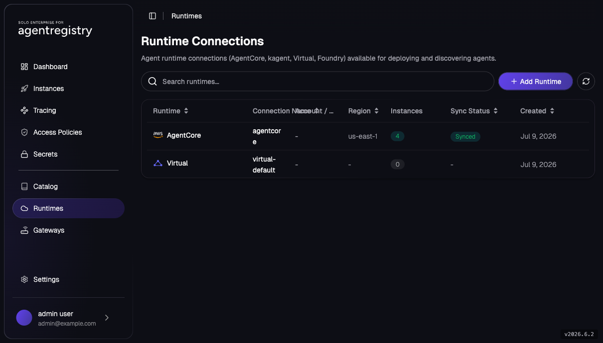

# Integrate Agentregistry and AgentCore

> **AWS Bedrock AgentCore series, Part 1 of 4**
> **Part 1: Integrate Agentregistry and AgentCore** (this lab) ·
> [Part 2: Create Agents](agentcore-02-create-agents.md) ·
> [Part 3: Register and Deploy Agents to AgentCore](agentcore-03-deploy-agents.md) ·
> [Part 4: LLM and MCP Through Agentgateway](agentcore-04-agentgateway-llm-mcp.md) ·
> [Cleanup](agentcore-cleanup.md)

Wire agentregistry to **AWS Bedrock AgentCore**: build the AWS side from zero, grant the registry
server AWS access, generate the cross-account IAM role it assumes at deploy time, and register
**AgentCore** as an agentregistry `Runtime` named `agentcore`. By the end, the catalog has a live
cloud deploy target. [Part 3](agentcore-03-deploy-agents.md) publishes agents and deploys them
to it.

Unlike the MCP labs, the workload won't run on your cluster: the registry drives a **cloud
runtime** in your AWS account through a scoped cross-account IAM role.

> **Cost note:** this part creates only IAM principals and a CloudFormation stack, none of which
> bill on their own. The resources that cost money (the AgentCore runtime, image builds,
> CloudWatch logs, Bedrock invocations) appear in Part 3; [Cleanup](agentcore-cleanup.md) removes
> everything for the whole series.

## Lab Objectives

- Set up the AWS side from zero: CLI, operator credentials, region, Bedrock model availability
- Grant the registry server AWS access (IAM policies + user, then `helm upgrade`)
- Generate the cross-account IAM role with `arctl runtime setup bedrock-agent-core` + CloudFormation
- Register the `agentcore` Runtime in agentregistry

## Pre-requisites

This lab assumes you've finished 001 and nothing more. Every AWS piece is built from scratch in
**Step 0**, so if you've never driven AWS from this machine, start there.

- [001 - Installation](../../001-installation.md) complete (Agentregistry + Keycloak + login)
- **An AWS account you can administer**, specifically the rights to create IAM users, policies,
  and roles and to create CloudFormation stacks. You act as the *operator* in this lab, and
  provisioning the machine identity the registry uses requires those broad privileges. Step 0.2
  explains this two-identity model.
- **Console access to that same account** is useful but not always required: if your account has
  never invoked an Anthropic model, AWS may ask for one-time use-case details in the console
  (Step 0.4).
- The workshop tooling from 001 already on your PATH: `kubectl`, `helm`, `jq`, `openssl`,
  `envsubst`, and `arctl` (at `~/.arctl/bin`). The **AWS CLI** is the one new dependency this lab
  adds; Step 0.1 installs it if it's missing.
- Your shell context from 001 (re-run this in every new shell you use for this lab):

```bash
export PATH=$HOME/.arctl/bin:$PATH
source ~/.are-keycloak-env
export AR_IP=$(kubectl get svc agentregistry-enterprise-server -n agentregistry-system \
  -o jsonpath='{.status.loadBalancer.ingress[0].ip}{.status.loadBalancer.ingress[0].hostname}')
export ARCTL_API_BASE_URL="http://${AR_IP}:12121"

export AR_USER_PREFIX=$(whoami)   # keeps this lab's AWS resource names unique per person
                                   # if you're sharing an AWS account with teammates
```

## Architecture

The full flow across the three parts. This part builds everything from the registry server down
to the AgentCore runtime boundary; Part 3 drives a deploy through it:

```
arctl / registry UI
  │
  ▼
[ agentregistry server (agentregistry-system) ]
  │  AWS credentials (helm values: aws.*)          ◀── Step 1
  │  sts:AssumeRole + ExternalId
  ▼
[ cross-account IAM role (CloudFormation stack) ]  ◀── Step 2
  │
  ├── clones agent source ──▶ github.com/.../assets/agents/econresearch
  ├── builds the AgentCore image from its Dockerfile
  ▼
[ AWS Bedrock AgentCore runtime ] ──▶ Bedrock Claude (us.anthropic.claude-sonnet-4-6)
  │
  └── logs ──▶ CloudWatch /aws/bedrock-agentcore/runtimes/<runtime-id>-DEFAULT
```

## 0. Set Up the AWS Side

Lab 001 gave you a Kubernetes cluster with Agentregistry and Keycloak, and **nothing** on the
AWS side. This step builds all of that from zero. Work through the five parts in order; by the end
you'll have an authenticated AWS CLI, a region chosen, Bedrock model availability confirmed, and
a confirmed registry session.

### 0.1 Install the AWS CLI

Check whether it's already present:

```bash
aws --version
```

If that prints a version (`aws-cli/2.x.x ...`), move on. If it's "command not found", install it
following the official guide for your OS:
<https://docs.aws.amazon.com/cli/latest/userguide/getting-started-install.html>. On macOS the
quickest path is Homebrew:

```bash
brew install awscli
```

Re-run `aws --version` afterwards to confirm it's on your PATH.

### 0.2 Authenticate as Yourself (the Operator)

This lab uses **two AWS identities**:

- **You, the operator** (this step): a human with **broad** rights. You need to create IAM users,
  policies, and roles and to deploy CloudFormation, because you're *provisioning* the environment.
  Every `aws` command in this lab runs as you, the operator. The deployer's keys go only into
  the registry via helm and are deliberately never exported into your shell.
- **The registry's machine identity** (created in Step 1): a **narrow**, long-lived IAM user
  whose only real power is to assume one scoped role. The registry server uses it; you don't.

Get your operator credentials in place. If your organization issues IAM users with access keys,
run:

```bash
aws configure
```

It prompts for four values:

- **AWS Access Key ID** and **AWS Secret Access Key**: your personal programmatic credentials.
  Generate them in the AWS console: **IAM → Users → *your user* → Security credentials → Create
  access key**. Copy both immediately; the secret is shown only once.
- **Default region name**: e.g. `us-east-1` (you'll formalize this in Step 0.3).
- **Default output format**: `json` is a fine default.

> If your organization uses **SSO / IAM Identity Center**, don't use `aws configure`. Run
> `aws configure sso` once to create a profile, then `aws sso login` to start a session. Your
> admin can supply the SSO start URL and region.

Verify you're authenticated **as the right identity in the right account**:

```bash
aws sts get-caller-identity
```

```json
{
    "UserId": "AIDA...",
    "Account": "123456789012",
    "Arn": "arn:aws:iam::123456789012:user/your-name"
}
```

Check two fields: **`Account`** is the account you intend to build in, and **`Arn`** is *you*
(your IAM user or SSO role), not a leftover role or a teammate's credentials. Everything
downstream lands in this account.

### 0.3 Pick a Region

Both **Bedrock AgentCore** and the **Claude model** the agents call must be available in the
region you pick; not every AWS region carries both. `us-east-1` has them and is the region this
lab assumes; use it unless you have a specific reason not to. Set the region and capture your
account ID:

```bash
export AWS_REGION=us-east-1   # any region with Bedrock AgentCore + Claude models
export AWS_ACCOUNT_ID=$(aws sts get-caller-identity --query Account --output text)
```

The `--query Account --output text` on the second line pulls just the account number out of the
`get-caller-identity` response (the same call you ran in 0.2) as a bare string, so
`AWS_ACCOUNT_ID` holds `123456789012` rather than the full JSON. Later steps interpolate it into
policy ARNs.

### 0.4 Confirm Bedrock Model Access

Bedrock **serverless foundation models are enabled automatically** the first time they're
invoked in your account (AWS retired the old "Model access" opt-in page), so there's no manual
enablement step. Two caveats still apply:

- **First-time Anthropic use.** If your account has never invoked an Anthropic model, AWS may
  ask you to submit use-case details once before granting access. If the first chat in Part 3
  returns an `AccessDeniedException`, open a Claude model from the Bedrock **Model catalog** in
  the console, try it in the playground, submit the requested details, and chat again; no
  redeploy is needed.
- **Admin restrictions.** Account administrators can still restrict models through IAM policies
  and Service Control Policies. If you're in a managed account and Claude invocations are
  denied, check with your admin.

> **Inference profile vs. plain model ID.** The `us.` prefix on `us.anthropic.claude-sonnet-4-6`
> marks a **cross-region inference profile**, a routing alias that load-balances your request
> across the US regions behind it, rather than a single foundation-model ID like
> `anthropic.claude-sonnet-4-6`. Newer Claude models are often *only* callable through their
> profile, which is why the scaffold uses the `us.`-prefixed name.

Confirm from the CLI that the Anthropic foundation models are available in your region:

```bash
aws bedrock list-foundation-models --region "${AWS_REGION}" \
  --by-provider anthropic \
  --query "modelSummaries[].modelId" --output table
```

You should get a table of `anthropic.*` model IDs. Because `us.anthropic.claude-sonnet-4-6` is the
cross-region *inference profile* layered over these foundation models (see the note above), it
won't appear verbatim in this list. Seeing the underlying `anthropic.claude-sonnet-*` entries
confirms the models are available in your region.

### 0.5 Confirm Your Registry Session Is Still Valid

Your `arctl` login from 001 is a bearer token that expires. If you're picking this lab up in a
fresh shell or a day later, confirm the session before spending time on AWS work:

```bash
arctl user whoami
```

If it prints your identity and roles, you're set. If it errors (expired or missing token), re-run
the `arctl user login` step from [001 - Installation](../../001-installation.md) in this shell.
That login reads the `${OIDC_ISSUER}` / `${ARE_CLI_CLIENT_ID}` values the shell-context block
sourced from `~/.are-keycloak-env` above.

## 1. Grant the Registry AWS Access

The registry server needs AWS credentials to assume the cross-account role you'll create in
step 2. The baseline install has no AWS configuration, so create a scoped IAM user and add its
credentials via `helm upgrade`.

**This lab builds a two-identity model:**

1. A **base identity**: the `${AR_USER_PREFIX}-agentregistry-deployer` IAM user with long-lived
   access keys. These keys are what the server pod actually holds (delivered as helm `aws.*`
   values). On their own they can do almost nothing privileged: the whole point of the base
   identity is to be a *starting principal* whose only real job is to call `sts:AssumeRole`.
   Every fixed name this lab creates gets your `AR_USER_PREFIX` prepended — if you're in a
   personal AWS account this is cosmetic, but in a **shared account** (a team sandbox, say) it's
   what stops your setup and a teammate's from colliding on the same IAM user, policies, or
   CloudFormation stack.
2. A **cross-account role** (Step 2) that carries the real AgentCore permissions. The server
   assumes this role at deploy time to get short-lived credentials.

Why split them? Because the powerful permissions live on the role, not on the keys sitting in your
cluster. The role can be revoked, rotated, or re-scoped independently of the pod's credentials,
and its trust policy decides *who* may assume it. In a real enterprise the role commonly lives
in a **different AWS account** (a workload account) from the deployer user (a shared platform
account). Same handshake either way; this lab just keeps both in one account for simplicity.

> Running on EKS? You can use [EKS Pod Identity](https://docs.solo.io/agentregistry/latest/quickstart/agentcore/)
> instead of an IAM user; see the docs quickstart. This lab uses the IAM-user path because it
> works from any Kubernetes cluster.

Create the two IAM policies (checked in at `assets/runtimes/agentcore/`, verbatim from the
[docs quickstart](https://docs.solo.io/agentregistry/latest/quickstart/agentcore/), with your
`AR_USER_PREFIX` on the name so they don't collide with a teammate's copy in a shared account):

```bash
aws iam create-policy \
  --policy-name "${AR_USER_PREFIX}-AgentRegistryGeneralAccess" \
  --policy-document file://assets/runtimes/agentcore/general-access-policy.json

aws iam create-policy \
  --policy-name "${AR_USER_PREFIX}-AgentRegistryBedrockAgentCoreAccess" \
  --policy-document file://assets/runtimes/agentcore/bedrock-agentcore-policy.json
```

**What the two policies grant:**

- **`AgentRegistryGeneralAccess`** uses an `Allow` with **`NotAction`** rather than `Action`: it
  permits *every* AWS action **except** `iam:*`, `organizations:*`, and `account:*`. Read it as
  "broad operational access, minus the ability to escalate its own privileges or touch org/account
  structure." `NotAction` is the pragmatic choice here because AgentCore's build-and-deploy flow
  touches many services (ECR, S3, CloudWatch, KMS, and more); enumerating them all would be
  brittle. The dangerous verbs (creating IAM users and roles, editing the organization) are
  exactly what's carved out, and a second statement adds back a small set of account/organization
  reads plus service-linked-role lifecycle calls
  (`iam:CreateServiceLinkedRole`/`iam:DeleteServiceLinkedRole`) and `iam:ListRoles` that the flow
  genuinely needs.
- **`AgentRegistryBedrockAgentCoreAccess`** is the fine-grained half: the full `bedrock-agentcore:*`
  runtime-management surface (create/update/delete runtimes), plus the scoped read paths AgentCore
  needs: KMS decrypt, S3 code-artifact buckets, CloudWatch Logs, ECR. The key line is
  **`iam:PassRole`**: creating an AgentCore runtime means handing it an execution role to *run as*,
  and `PassRole` is the permission to do that hand-off. It's condition-scoped to
  `iam:PassedToService: bedrock-agentcore.amazonaws.com` and to role names matching
  `*BedrockAgentCore*`, so the deployer can pass roles **only** to AgentCore, never to EC2,
  Lambda, or anything else it might otherwise use to escalate.

Create the deployer IAM user, attach both policies, and mint an access key:

```bash
export AR_DEPLOYER_USER="${AR_USER_PREFIX}-agentregistry-deployer"

aws iam create-user --user-name "${AR_DEPLOYER_USER}"

aws iam attach-user-policy \
  --user-name "${AR_DEPLOYER_USER}" \
  --policy-arn "arn:aws:iam::${AWS_ACCOUNT_ID}:policy/${AR_USER_PREFIX}-AgentRegistryGeneralAccess"

aws iam attach-user-policy \
  --user-name "${AR_DEPLOYER_USER}" \
  --policy-arn "arn:aws:iam::${AWS_ACCOUNT_ID}:policy/${AR_USER_PREFIX}-AgentRegistryBedrockAgentCoreAccess"

ACCESS_KEY_OUTPUT=$(aws iam create-access-key --user-name "${AR_DEPLOYER_USER}")
export AR_AWS_ACCESS_KEY_ID=$(echo "$ACCESS_KEY_OUTPUT" | jq -r '.AccessKey.AccessKeyId')
export AR_AWS_SECRET_ACCESS_KEY=$(echo "$ACCESS_KEY_OUTPUT" | jq -r '.AccessKey.SecretAccessKey')
```

> The deployer keys are captured under `AR_`-prefixed names on purpose: exporting them as
> `AWS_ACCESS_KEY_ID`/`AWS_SECRET_ACCESS_KEY` would override your own credentials for every
> later `aws` command in this shell, and the deployer can't create IAM roles or delete stacks.
> `AR_DEPLOYER_USER` is re-derived from `AR_USER_PREFIX` (i.e. `$(whoami)`), so a fresh shell
> reproduces the same name without needing to persist it anywhere.

Add the AWS settings to the registry install (all baseline values are preserved via
`--reuse-values`):

```bash
helm upgrade agentregistry-enterprise \
  oci://us-docker.pkg.dev/solo-public/agentregistry-enterprise/helm/agentregistry-enterprise \
  --version 2026.6.2 \
  --namespace agentregistry-system \
  --reuse-values \
  --set aws.enabled=true \
  --set-string aws.accountId="${AWS_ACCOUNT_ID}" \
  --set-string aws.region="${AWS_REGION}" \
  --set-string aws.accessKeyId="${AR_AWS_ACCESS_KEY_ID}" \
  --set-string aws.secretAccessKey="${AR_AWS_SECRET_ACCESS_KEY}" \
  --wait --timeout 5m

kubectl rollout status deployment/agentregistry-enterprise-server -n agentregistry-system
```

**What just happened.** `--reuse-values` tells helm to start from the *currently deployed* values
and layer only your `--set` overrides on top. Without it, the upgrade would reset everything you
configured in 001 back to chart defaults. The chart renders the `aws.*` values into a Kubernetes
`Secret` and injects them into the server pod's environment; the `--wait` plus `rollout status`
force and confirm a fresh pod that actually picks up the new credentials (a running pod keeps its
old environment). If a pod ever predates the change, the Troubleshooting row below forces a restart.

## 2. Create the Cross-Account IAM Role

`arctl` generates a CloudFormation template for the role agentregistry assumes to drive
AgentCore, covering the Bedrock AgentCore APIs, IAM (per-agent execution roles), S3 (code
artifacts), and CloudWatch Logs. `--role-name` is the one piece of this `arctl` lets you
parameterize, so give it a prefixed name too:

```bash
export AR_ROLE_NAME="${AR_USER_PREFIX}-AgentRegistryAccessRole"

arctl runtime setup bedrock-agent-core \
  --aws-account-id "${AWS_ACCOUNT_ID}" \
  --role-name "${AR_ROLE_NAME}" \
  > /tmp/agentregistry-cf.yaml
```

**The handshake this sets up.** The generated role has two halves: a *permission policy* (what the
role can do: the AgentCore surface from Step 1) and a **trust policy** (who is allowed to *become*
the role). The trust policy names the `agentregistry-deployer` principal and requires a matching
**ExternalId**. At deploy time the registry calls `sts:AssumeRole` with that role ARN and external
ID and receives **short-lived** credentials. This is why the long-lived keys in your cluster hold
so little power directly.

The **ExternalId** guards against the *confused-deputy* problem: it's a value both sides must
present (the trust policy requires it and the caller supplies it on every `AssumeRole` call), so
a third party who learns your role ARN still can't get AWS to assume it on their behalf without
also knowing the ID. AWS advises treating it as a unique identifier rather than a secret.
Illustrative excerpt of the generated trust policy (don't apply it; `arctl` writes the real one
for you):

```yaml
# illustration only; see the real values in /tmp/agentregistry-cf.yaml
Principal:
  AWS: "arn:aws:iam::<account>:user/agentregistry-deployer"
Action: "sts:AssumeRole"
Condition:
  StringEquals:
    sts:ExternalId: "<generated-external-id>"
```

> **The trust policy's principal isn't parameterized by `arctl`** — unlike `--role-name`, there's
> no flag for the deployer username, so the generated template always trusts the literal
> `agentregistry-deployer` principal (as shown above), regardless of what you actually named your
> Step 1 user. Since this lab renamed that user to `${AR_DEPLOYER_USER}`, patch the template
> before applying it, or `AssumeRole` will reject your deployer as an untrusted principal:
>
> ```bash
> grep -q "user/agentregistry-deployer" /tmp/agentregistry-cf.yaml || {
>   echo "ERROR: expected principal 'agentregistry-deployer' not found in the generated" >&2
>   echo "template — arctl's output may have changed shape; inspect the file by hand" >&2
>   echo "before applying it: /tmp/agentregistry-cf.yaml" >&2
>   exit 1
> }
> sed -i '' "s#user/agentregistry-deployer#user/${AR_DEPLOYER_USER}#" /tmp/agentregistry-cf.yaml
> # GNU sed (Linux): drop the '' after -i
> ```
>
> The `grep -q` guard is there on purpose: if a future `arctl` version changes the template's
> shape, this fails loudly instead of silently deploying a role that still trusts someone else's
> `agentregistry-deployer` user.

Deploy the stack and wait for it to complete (~1 minute):

```bash
export AR_STACK_NAME="${AR_USER_PREFIX}-agentregistry-access-role"

aws cloudformation create-stack \
  --stack-name "${AR_STACK_NAME}" \
  --template-body file:///tmp/agentregistry-cf.yaml \
  --capabilities CAPABILITY_NAMED_IAM \
  --region "${AWS_REGION}"

aws cloudformation wait stack-create-complete \
  --stack-name "${AR_STACK_NAME}" \
  --region "${AWS_REGION}"
```

`--capabilities CAPABILITY_NAMED_IAM` is **required** because this template creates a *named* IAM
role. CloudFormation refuses to create IAM principals unless you explicitly acknowledge it, a
guardrail against a template quietly creating privileged identities. `NAMED_IAM` (rather than
plain `CAPABILITY_IAM`) is the variant you need when the resources have fixed names you chose, as
here.

Capture the role ARN and external ID from the stack outputs:

```bash
export AWS_ROLE_ARN=$(aws cloudformation describe-stacks \
  --stack-name "${AR_STACK_NAME}" --region "${AWS_REGION}" \
  --query "Stacks[0].Outputs[?OutputKey=='RoleArn'].OutputValue" --output text)

export AWS_EXTERNAL_ID=$(aws cloudformation describe-stacks \
  --stack-name "${AR_STACK_NAME}" --region "${AWS_REGION}" \
  --query "Stacks[0].Outputs[?OutputKey=='ExternalId'].OutputValue" --output text)

echo "AWS_ROLE_ARN=${AWS_ROLE_ARN}"
echo "AWS_EXTERNAL_ID=${AWS_EXTERNAL_ID}"
```

> If `ExternalId` is not among your stack outputs, it's printed in the generated template:
> `grep -i externalid /tmp/agentregistry-cf.yaml`.

## 3. Register the `agentcore` Runtime

A **`Runtime`** in agentregistry is a *deploy target* record: a `type` plus the connection config
needed to reach it. The seeded `virtual-default` runtime is `Virtual`; it publishes MCP servers
through the in-cluster Agentgateway (the path the MCP labs use). This one is `BedrockAgentCore`,
pointing at AWS via the `roleArn`, `externalId`, and `region` you just captured. Registering a
runtime tells the catalog that deployments may target it.

```bash
cat > /tmp/agentcore-runtime.yaml <<EOF
apiVersion: ar.dev/v1alpha1
kind: Runtime
metadata:
  name: agentcore
spec:
  type: BedrockAgentCore
  config:
    roleArn: "${AWS_ROLE_ARN}"
    externalId: "${AWS_EXTERNAL_ID}"
    region: "${AWS_REGION}"
EOF

arctl apply -f /tmp/agentcore-runtime.yaml
arctl get runtimes
```

Expected output: `agentcore` alongside the baseline runtimes:

```
NAME                 TYPE
agentcore            BedrockAgentCore
kubernetes-default   Kubernetes
local                Local
virtual-default      Virtual
```

The UI's **Runtimes** view (`http://${AR_IP}:12121/are/runtimes`) shows the same connection with
a live sync status. The Instances count fills in as you deploy agents in Part 3:



> **`apply` doesn't validate the credentials.** `roleArn` / `externalId` / `region` are stored as
> config and only *used* lazily, at deploy time, when the registry actually attempts the
> `sts:AssumeRole`. So a wrong `externalId` or a mistyped ARN will `apply` cleanly here and only
> surface later as a failed **Deployment** condition (see the "IAM role not assumable" row in
> [Part 3's Troubleshooting](agentcore-03-deploy-agents.md#troubleshooting)), not as an error on
> this step.

The integration is now complete. The registry holds the deployer credentials, the cross-account
role exists with its trust handshake, and the catalog has an `agentcore` deploy target. The role
ARN and external ID are stored on the Runtime, so the only environment variable Part 3 needs
to carry over is `AWS_REGION`.

## Troubleshooting

| Symptom | Fix |
|---|---|
| `helm upgrade` succeeded but the server can't reach AWS | The server pod may predate the new `aws.*` values. `kubectl rollout restart deployment/agentregistry-enterprise-server -n agentregistry-system` and re-check. |
| `create-stack` fails with `InsufficientCapabilitiesException` | You omitted `--capabilities CAPABILITY_NAMED_IAM`. Re-run the `create-stack` command from step 2 as written. |

A wrong `externalId` or mistyped role ARN won't error in this lab at all; it surfaces as a failed
Deployment condition in [Part 3](agentcore-03-deploy-agents.md#troubleshooting).

## Cleanup

If you're continuing to [Part 2](agentcore-02-create-agents.md) or
[Part 3](agentcore-03-deploy-agents.md), **skip this section**; everything this lab built is what
those labs run on. When you're done with the whole series, tear it down with the
["If you completed Part 1"](agentcore-cleanup.md#if-you-completed-part-1-integrate-agentregistry-and-agentcore)
section of the consolidated [Cleanup](agentcore-cleanup.md) guide — run it **last**, after any
Part 3/4 deployments are gone, since a Deployment can't outlive the Runtime it targets.

## Next

- [Part 2: Create Agents](agentcore-02-create-agents.md) covers how an AgentCore-deployable
  agent is built: the `econresearch` ADK/Bedrock scaffold, its tools, and its catalog entry (no
  AWS required).
- [Part 3: Register and Deploy Agents to AgentCore](agentcore-03-deploy-agents.md) publishes
  `econresearch` to the catalog and deploys it to the runtime you just registered.
- [Part 4: LLM and MCP Through Agentgateway](agentcore-04-agentgateway-llm-mcp.md) extends
  `econresearch` so its LLM and MCP traffic both route through Agentgateway.
