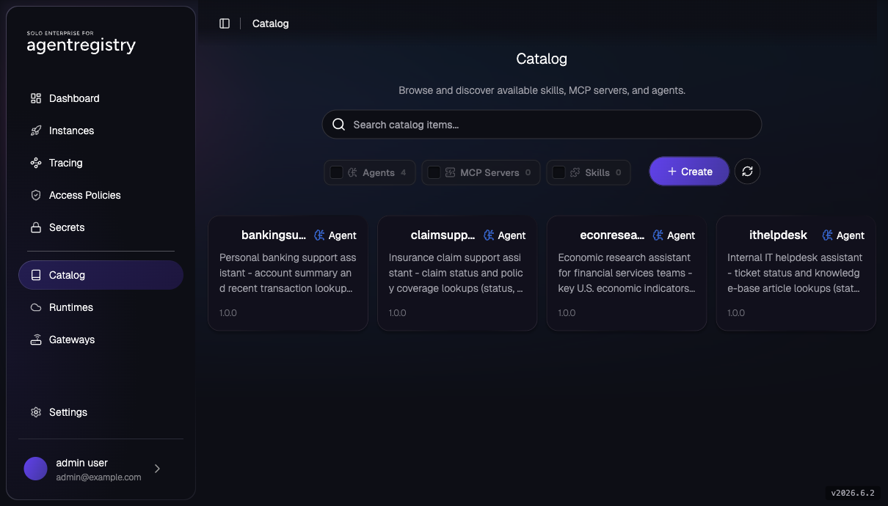
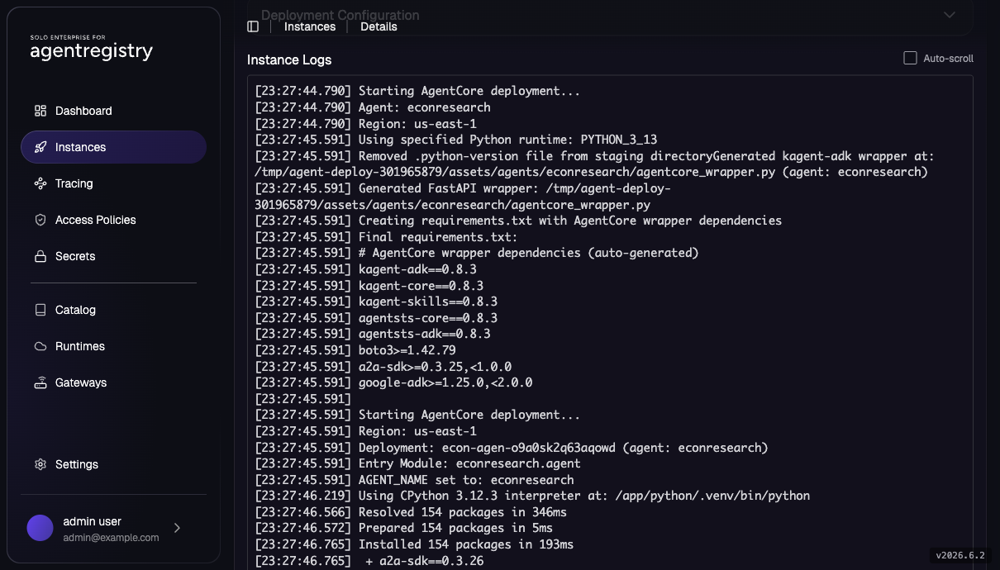
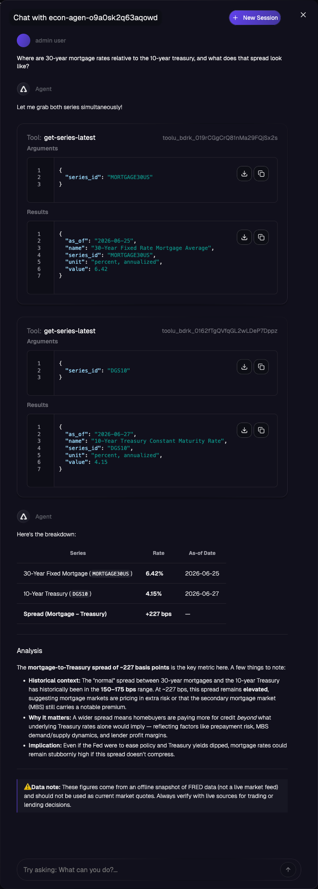
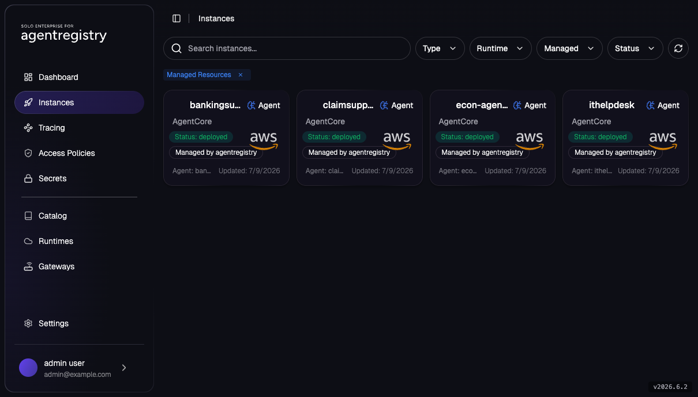
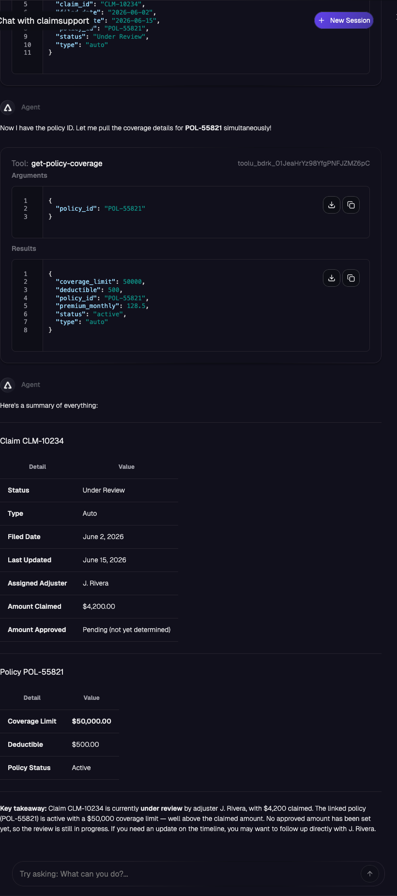
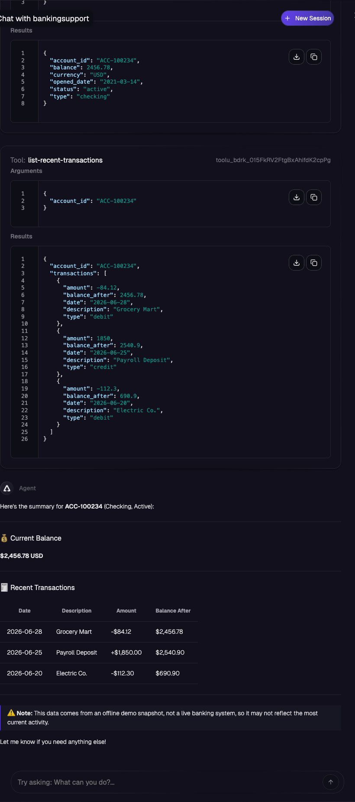
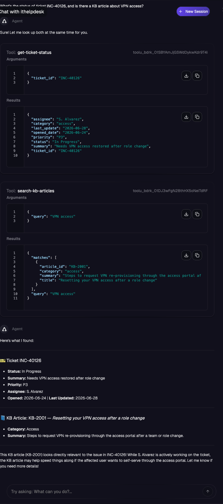

# Register and Deploy Agents to AgentCore

> **AWS Bedrock AgentCore series, Part 3 of 4**
> [Part 1: Integrate Agentregistry and AgentCore](agentcore-01-integration.md) ·
> [Part 2: Create Agents](agentcore-02-create-agents.md) ·
> **Part 3: Register and Deploy Agents to AgentCore** (this lab) ·
> [Part 4: LLM and MCP Through Agentgateway](agentcore-04-agentgateway-llm-mcp.md)

Publish the **`econresearch`** agent to the catalog and deploy it to the `agentcore` Runtime you
registered in Part 1. Agentregistry clones the agent source from GitHub, builds the
AgentCore-compatible image, hands it to AgentCore, and you watch the Deployment go from
`deploying` to `deployed`. Then chat with the agent from the registry UI, tail its CloudWatch
logs, and deploy the other three vertical agents from Part 2 the same way.

> **Cost note:** this lab creates real AWS resources (an AgentCore runtime, an ECR/S3-backed
> image build, CloudWatch logs) and invokes a Bedrock model. Costs are small but non-zero; the
> Cleanup section removes everything.

## Lab Objectives

- Publish the `econresearch` Agent to the catalog and deploy it to AgentCore
- Chat with the deployed agent in the registry UI and locate its CloudWatch log group
- Deploy the three other example agents (`claimsupport`, `bankingsupport`, `ithelpdesk`)

## Pre-requisites

- [Part 1: Integrate Agentregistry and AgentCore](agentcore-01-integration.md) complete and
  **not cleaned up**: the registry holds the deployer credentials, the cross-account role stack
  exists, and `arctl get runtimes` shows `agentcore`.
- [Part 2: Create Agents](agentcore-02-create-agents.md) is recommended reading; it explains
  the agent source and catalog entries you're about to publish, but requires no setup.
- Your operator AWS CLI session from Part 1 step 0 (used here only to tail CloudWatch logs).
- Your shell context (re-run in every new shell you use for this lab):

```bash
export PATH=$HOME/.arctl/bin:$PATH
source ~/.are-keycloak-env
export AR_IP=$(kubectl get svc agentregistry-enterprise-server -n agentregistry-system \
  -o jsonpath='{.status.loadBalancer.ingress[0].ip}{.status.loadBalancer.ingress[0].hostname}')
export ARCTL_API_BASE_URL="http://${AR_IP}:12121"

export AWS_REGION=us-east-1   # must match the region you used in Part 1
```

- Confirm your registry session is still valid with `arctl user whoami`; if it errors, re-run
  the `arctl user login` step from [001 - Installation](../../001-installation.md).

## 1. Publish the `econresearch` Agent

The catalog entry points at this repo: agentregistry clones `assets/agents/econresearch/` and
builds its Dockerfile at deploy time. [Part 2](agentcore-02-create-agents.md) walks through the
entry field by field.

```bash
cat assets/agents/econresearch/agent.yaml
arctl apply -f assets/agents/econresearch/agent.yaml
arctl get agents
```

Published agents also appear in the UI's **Catalog** view
(`http://${AR_IP}:12121/are/catalog`). Shown here with all four agents from this lab published
(the other three come in section 4):



## 2. Deploy the Agent to AgentCore

```bash
arctl apply -f - <<EOF
apiVersion: ar.dev/v1alpha1
kind: Deployment
metadata:
  name: econresearch
spec:
  targetRef:
    kind: Agent
    name: econresearch
    tag: "1.0.0"
  runtimeRef:
    kind: Runtime
    name: agentcore
  runtimeConfig:
    region: ${AWS_REGION}
    workdir: assets/agents/econresearch
EOF
```

Watch it progress; the clone, image build, and AgentCore rollout take a few minutes:

```bash
arctl get deployments
arctl get deployment econresearch -o yaml
```

The Deployment moves through `deploying` → `deployed`. Under the hood, that transition is several
distinct phases: the registry (1) assumes the cross-account role for short-lived credentials,
(2) clones the Git subfolder recorded on the Agent (`assets/agents/econresearch`) from the catalog
source, (3) builds that Dockerfile into an image and pushes it into your AWS account, and
(4) creates the AgentCore runtime from the image. That's why the **first** deploy takes minutes
(the image build dominates), and why a failure's `status.conditions` usually points at one
specific phase: an IAM/assume-role error, a clone error, or a build error. You can also watch
build progress in the UI's **Instances** view (`http://${AR_IP}:12121/are/instances/`) under
**Instance Logs**:



## 3. Chat with the Agent + Tail CloudWatch

Open the **Instances** view in the UI (`http://${AR_IP}:12121/are/instances/`), select
`econresearch`, and ask it something a financial-services analyst would:

> Where are 30-year mortgage rates relative to the 10-year treasury, and what does that spread
> look like?

The answer should be grounded in tool calls, citing `MORTGAGE30US` / `DGS10` and the as-of dates
of the snapshot:



AgentCore creates a **separate CloudWatch log group per runtime** named
`/aws/bedrock-agentcore/runtimes/<runtime-id>-DEFAULT` (the `-DEFAULT` suffix is the runtime
version's default endpoint), so the id changes when you redeploy a new version. This is where your
agent's stdout/stderr and the AgentCore framework logs land, and it's the first place to look
when the agent misbehaves at runtime. The `<runtime-id>` appears in
`arctl get deployment econresearch -o yaml` under `status`:

```bash
aws logs describe-log-groups \
  --region "${AWS_REGION}" \
  --log-group-name-prefix /aws/bedrock-agentcore/runtimes/

# Tail the active group (substitute your <runtime-id>):
aws logs tail "/aws/bedrock-agentcore/runtimes/<runtime-id>-DEFAULT" \
  --region "${AWS_REGION}" --follow
```

## 4. Deploy More Example Agents (optional)

The catalog has three more vertical-use-case example agents built the same way as
`econresearch`: same ADK/Bedrock scaffold ([Part 2](agentcore-02-create-agents.md) walks through
them), same `agentcore` Runtime from Part 1, and no new AWS setup required:

| Agent | Use case | Tools |
|---|---|---|
| [`claimsupport`](../../assets/agents/claimsupport/) | Insurance claim support | `get_claim_status`, `get_policy_coverage` |
| [`bankingsupport`](../../assets/agents/bankingsupport/) | Personal banking support | `get_account_summary`, `list_recent_transactions` |
| [`ithelpdesk`](../../assets/agents/ithelpdesk/) | Internal IT helpdesk | `get_ticket_status`, `search_kb_articles` |

Publish and deploy each one the same way you did `econresearch` in sections 1-2:

```bash
arctl apply -f assets/agents/claimsupport/agent.yaml
arctl apply -f - <<EOF
apiVersion: ar.dev/v1alpha1
kind: Deployment
metadata:
  name: claimsupport
spec:
  targetRef:
    kind: Agent
    name: claimsupport
    tag: "1.0.0"
  runtimeRef:
    kind: Runtime
    name: agentcore
  runtimeConfig:
    region: ${AWS_REGION}
    workdir: assets/agents/claimsupport
EOF

arctl apply -f assets/agents/bankingsupport/agent.yaml
arctl apply -f - <<EOF
apiVersion: ar.dev/v1alpha1
kind: Deployment
metadata:
  name: bankingsupport
spec:
  targetRef:
    kind: Agent
    name: bankingsupport
    tag: "1.0.0"
  runtimeRef:
    kind: Runtime
    name: agentcore
  runtimeConfig:
    region: ${AWS_REGION}
    workdir: assets/agents/bankingsupport
EOF

arctl apply -f assets/agents/ithelpdesk/agent.yaml
arctl apply -f - <<EOF
apiVersion: ar.dev/v1alpha1
kind: Deployment
metadata:
  name: ithelpdesk
spec:
  targetRef:
    kind: Agent
    name: ithelpdesk
    tag: "1.0.0"
  runtimeRef:
    kind: Runtime
    name: agentcore
  runtimeConfig:
    region: ${AWS_REGION}
    workdir: assets/agents/ithelpdesk
EOF

arctl get deployments
```

Each deploys independently (its own clone, image build, and AgentCore rollout) and shows up
alongside `econresearch` in `arctl get deployments`:



Chat with each from the **Instances** view (`http://${AR_IP}:12121/are/instances/`). Try:

- `claimsupport`: "What's the status of claim CLM-10234, and what's the coverage limit on its
  policy?"

  

- `bankingsupport`: "What's the balance on ACC-100234 and what were the last few transactions?"

  

- `ithelpdesk`: "What's the status of ticket INC-40126, and is there a KB article about VPN
  access?"

  

## Troubleshooting

| Symptom | Fix |
|---|---|
| Deployment condition: IAM role not assumable | The `externalId` in the Runtime must match the role's trust policy. Re-check [Part 1 step 2](agentcore-01-integration.md#2-create-the-cross-account-iam-role)'s `AWS_EXTERNAL_ID` against `grep -i externalid /tmp/agentregistry-cf.yaml`, re-apply the Runtime. |
| Deployment condition: image build failed | Check the registry server logs: `kubectl logs -n agentregistry-system deploy/agentregistry-enterprise-server --tail=100` |
| Agent deploys but replies with a Bedrock `AccessDeniedException` | Your account may need one-time use-case details submitted before it can invoke Anthropic models, or an IAM/SCP restriction is blocking the model. Open a Claude model from the Bedrock **Model catalog** in the console and try it in the playground (see [Part 1 step 0.4](agentcore-01-integration.md#04-confirm-bedrock-model-access)); no redeploy needed once access is granted. |
| Stuck in `deploying` | Inspect `status.conditions` in `arctl get deployment econresearch -o yaml`, then the server logs (above). CloudFormation/IAM changes can take ~1 min to propagate on first deploy. |
| `helm upgrade` succeeded but the server can't reach AWS | The server pod may predate the `aws.*` values from Part 1. `kubectl rollout restart deployment/agentregistry-enterprise-server -n agentregistry-system` and re-check. |

## Cleanup

Remove the deployments and catalog entries this lab created:

```bash
arctl delete deployment econresearch
arctl delete agent econresearch --tag 1.0.0
arctl delete deployment claimsupport
arctl delete agent claimsupport --tag 1.0.0
arctl delete deployment bankingsupport
arctl delete agent bankingsupport --tag 1.0.0
arctl delete deployment ithelpdesk
arctl delete agent ithelpdesk --tag 1.0.0
```

> AgentCore also leaves behind each runtime's CloudWatch log group; remove them with
> `aws logs delete-log-group --log-group-name "/aws/bedrock-agentcore/runtimes/<runtime-id>-DEFAULT" --region "${AWS_REGION}"`
> if you want a fully clean account.

Then, to tear down the integration itself (the `agentcore` Runtime, the cross-account role
stack, the `agentregistry-deployer` IAM user, and the `aws.*` helm values), run
[Part 1's Cleanup](agentcore-01-integration.md#cleanup).

## Next

- [Part 4: LLM and MCP Through Agentgateway](agentcore-04-agentgateway-llm-mcp.md) does exactly
  what this agent teases: live FRED data via `spec.mcpServers` through Agentgateway — plus the
  LLM traffic routed through the same gateway.
- Govern who can see and submit the new assets: [AccessPolicy / RBAC](../access-control/access-policies.md)
  and [Approval Workflows](../access-control/approval-workflows.md).
