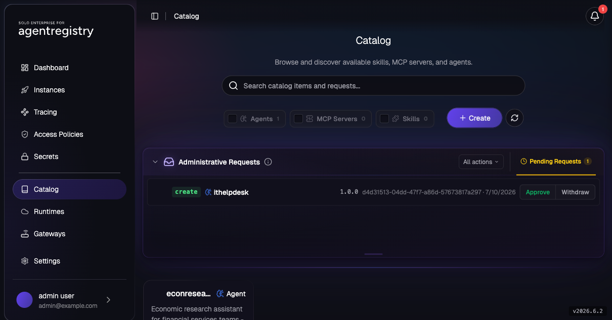

# Approval-Gated Agent Onboarding

> **AWS Bedrock AgentCore series, Part 4 of 5**
> [Part 1: Integrate Agentregistry and AgentCore](agentcore-01-integration.md) ·
> [Part 2: Create Agents](agentcore-02-create-agents.md) ·
> [Part 3: Register and Deploy Agents to AgentCore](agentcore-03-deploy-agents.md) ·
> **Part 4: Approval-Gated Agent Onboarding** (this lab) ·
> [Part 5: Route LLM and Registry-Managed MCP Through Agentgateway](agentcore-05-agentgateway-llm-mcp.md) ·
> [Cleanup](agentcore-cleanup.md)

In Parts 1–3 you published and deployed every agent as the registry admin, straight into the
catalog and on to AWS. Most platforms don't onboard agents that way: the team writing an
agent usually isn't the team accountable for what runs in the cloud account. This lab onboards
the fourth vertical agent from Part 2, `ithelpdesk`, through an approval gate. With
`config.requireCreateApproval=true`, a non-admin team member (`reader`) submits the agent and
the submission lands staged in an Administrative Requests queue instead of the catalog. While
it's staged, a `Deployment` targeting it can't resolve its target and sits pending. Only after
an admin approves the request does the deploy to AgentCore go through.

The approval mechanics (the feature flag, the three review methods, Withdraw-vs-reject
semantics) are covered in the
[Approval Workflows lab](../access-control/approval-workflows.md). This lab covers the runtime
side: what the gate means for an agent on its way to AWS.

> **Scope (from the approval lab):** approval gating covers catalog assets (`Agent`,
> `MCPServer`, `Skill`, `Prompt`). `Deployment` resources are not approval-gated, but a
> `Deployment` must reference a catalog agent, and a staged agent isn't in the catalog yet.
> That is how the gate reaches the runtime.

> **Cost note:** the deploy step creates the same real AWS resources as Part 3 (an AgentCore
> runtime, an ECR/S3-backed image build, CloudWatch logs) and the chat step invokes a Bedrock
> model. See [Cleanup](agentcore-cleanup.md).

## Lab Objectives

- Enable `config.requireCreateApproval=true`
- Grant `are-readers` publish/edit on agents
- Submit `ithelpdesk` as the non-admin `reader` and confirm it's staged, not committed
- Deploy the staged agent and confirm the `Deployment` can't resolve it and sits pending
- Approve the request (UI or curl) and watch the blocked Deployment proceed to AgentCore
- Chat with the governed agent, then restore the registry defaults

## Pre-requisites

- [Part 3: Register and Deploy Agents to AgentCore](agentcore-03-deploy-agents.md) complete and
  **not cleaned up**: the `agentcore` Runtime is registered and the registry holds the deployer
  credentials. `ithelpdesk` itself must not be published yet; Part 3 deliberately leaves
  it out.
- Concept background: [Approval Workflows](../access-control/approval-workflows.md) and
  [AccessPolicy / RBAC](../access-control/access-policies.md).
- Your shell context (re-run in every new shell you use for this lab):

```bash
export PATH=$HOME/.arctl/bin:$PATH
source ~/.are-keycloak-env
export AR_IP=$(kubectl get svc agentregistry-enterprise-server -n agentregistry-system \
  -o jsonpath='{.status.loadBalancer.ingress[0].ip}{.status.loadBalancer.ingress[0].hostname}')
export ARCTL_API_BASE_URL="http://${AR_IP}:12121"
export KC_IP=$(kubectl get svc keycloak -n keycloak \
  -o jsonpath='{.status.loadBalancer.ingress[0].ip}{.status.loadBalancer.ingress[0].hostname}')

export AWS_REGION=us-east-1   # must match the region you used in Part 1

# token helper for acting as each user without clobbering the keychain
token_for() {
  curl -s -X POST "http://${KC_IP}:8080/realms/agentregistry-enterprise/protocol/openid-connect/token" \
    -d grant_type=password -d client_id="${ARE_CLI_CLIENT_ID}" \
    -d username="$1" -d password="$1" -d "scope=openid profile" | jq -r .access_token
}
```

## 1. Enable the Approval Gate

`--reuse-values` preserves both the OIDC/telemetry values from install and the `aws.*` values
from Part 1:

```bash
helm upgrade --install agentregistry-enterprise \
  oci://us-docker.pkg.dev/solo-public/agentregistry-enterprise/helm/agentregistry-enterprise \
  --version 2026.6.2 \
  --namespace agentregistry-system \
  --reuse-values \
  --set config.requireCreateApproval=true
kubectl rollout status -n agentregistry-system deploy/agentregistry-enterprise-server
```

Verify:

```bash
kubectl -n agentregistry-system get configmap agentregistry-enterprise \
  -o jsonpath='{.data.REQUIRE_CREATE_APPROVAL}{"\n"}'
```

```
true
```

## 2. Let the Team Submit Agents

`reader` (group `are-readers`) is the submitting team member. Superusers bypass the queue
entirely, so the approval flow only comes into play when a non-admin can submit but not
commit. Grant the group publish/edit on agents (Keycloak policies use the group name):

```bash
arctl apply -f - <<EOF
apiVersion: ar.dev/v1alpha1
kind: AccessPolicy
metadata:
  name: are-readers-agent-onboarding
spec:
  description: "Agent publish/edit for are-readers; submissions are approval-gated"
  principals:
    - kind: Role
      name: "are-readers"
  rules:
    - actions: ["registry:read", "registry:publish", "registry:edit"]
      resources:
        - kind: agent
          name: "*"
EOF
```

## 3. Submit `ithelpdesk` as the Non-Admin

The catalog entry is the same one Part 2 built: a real Git-sourced agent, not a test stub.
Act as `reader` via `ARCTL_API_TOKEN`:

```bash
ARCTL_API_TOKEN=$(token_for reader) arctl apply -f assets/agents/ithelpdesk/agent.yaml
```

```
✓ Agent/ithelpdesk (1.0.0) staged
```

Staged means the agent is not in the catalog:

```bash
ARCTL_API_TOKEN=$(token_for reader) arctl get agent ithelpdesk --tag 1.0.0
```

```
Error: getting agent "ithelpdesk": resource not found
```

## 4. Try to Deploy the Staged Agent

Deploy exactly as Part 3 did:

```bash
arctl apply -f - <<EOF
apiVersion: ar.dev/v1alpha1
kind: Deployment
metadata:
  name: ithelpdesk
spec:
  targetRef:
    kind: Agent
    name: ithelpdesk
    tag: "1.0.0"
  runtimeRef:
    kind: Runtime
    name: agentcore
  runtimeConfig:
    region: ${AWS_REGION}
    workdir: assets/agents/ithelpdesk
EOF
```

```
✓ Deployment/ithelpdesk created
```

The `apply` itself succeeds because a `Deployment` isn't approval-gated. But its `targetRef`
points at an agent that isn't in the catalog yet, and the reconciler can't resolve it.
`arctl get deployments` shows the deployment stuck at `pending`:

```bash
arctl get deployments
```

```
NAME                   TARGET         VERSION   TYPE    RUNTIME     STATUS
default/econresearch   econresearch   1.0.0     agent   agentcore   deployed
default/ithelpdesk     ithelpdesk     1.0.0     agent   agentcore   pending
```

`-o yaml` shows why:

```bash
arctl get deployment ithelpdesk -o yaml
```

```yaml
status:
  conditions:
  - lastTransitionTime: "2026-07-10T20:02:49.430441479Z"
    message: 'resolve targetRef default/ithelpdesk@1.0.0: referenced resource not
      found'
    reason: ReferencePending
    status: "False"
    type: Ready
```

Nothing gets built or shipped to AWS; the `Deployment` waits until an admin acts on the
pending request. Nothing the submitting team does can move it forward.

## 5. Approve the Request

Log in to the AgentRegistry UI as `admin` at `http://${AR_IP}:12121`. A 🔔 badge appears on the
top-nav Notifications button; the **Catalog** page shows the pending item in an
**Administrative Requests** panel with **Approve** and **Withdraw** buttons (Withdraw is the
UI's name for reject):



Click **Approve** and confirm the native browser dialog (`Approve 1 item? "ithelpdesk"
(1.0.0)`). To do the same from the command line, use the `/v0/approve` API:

```bash
# list the pending tuple
curl -s -H "Authorization: Bearer $(token_for reader)" \
  "${ARCTL_API_BASE_URL}/v0/approve" | jq '.items[] | {kind,namespace,name,tag,state}'

# approve it (superuser token, exact tuple from the list call)
curl -s -X POST \
  -H "Authorization: Bearer $(token_for admin)" \
  -H "Content-Type: application/json" \
  -d '{"action":"approve","items":[{"kind":"Agent","namespace":"default","name":"ithelpdesk","tag":"1.0.0"}]}' \
  "${ARCTL_API_BASE_URL}/v0/approve" | jq .
```

Either way, the agent is now a normal catalog item:

```bash
arctl get agent ithelpdesk --tag 1.0.0
```

For the third review method (wiring `/v0/approve` into your own tooling) and reject/Withdraw
semantics, see the [Approval Workflows lab](../access-control/approval-workflows.md#4-approve-the-pending-request).

## 6. Watch the Deployment Proceed

You don't need to touch the `Deployment` again. Within seconds of approval, the reconciler
notices `ithelpdesk` is now resolvable and picks up the object you applied in step 4:

```bash
arctl get deployments
arctl get deployment ithelpdesk -o yaml
```

The condition moves from `ReferencePending` through `reason: Accepted` (`enterprise deployment
started`) to `type: Ready, status: "True", reason: Completed` (`deployment completed`), and
`arctl get deployments` shows `ithelpdesk` reach `deployed`. The clone, image build, and
AgentCore rollout take a few minutes on a first-ever build, as in
[Part 3](agentcore-03-deploy-agents.md#2-deploy-the-agent-to-agentcore). Once it reads
`deployed`, chat with it from the **Instances** view (`http://${AR_IP}:12121/are/instances/`):

> What's the status of ticket INC-40126, and is there a KB article about VPN access?


The result is the same as the admin-deployed agents in Part 3; the difference is that an
admin signed off before any AWS resources were created.

## 7. Restore Defaults

The deployed agent stays (Cleanup removes it later); the governance knobs go back to their
baseline so later labs start clean:

```bash
arctl delete accesspolicy are-readers-agent-onboarding

# disabling the flag does not release queued requests; reject any leftovers first
helm upgrade --install agentregistry-enterprise \
  oci://us-docker.pkg.dev/solo-public/agentregistry-enterprise/helm/agentregistry-enterprise \
  --version 2026.6.2 \
  --namespace agentregistry-system \
  --reuse-values \
  --set config.requireCreateApproval=false
kubectl rollout status -n agentregistry-system deploy/agentregistry-enterprise-server
```

## Troubleshooting

| Symptom | Fix |
|---|---|
| Step 4's Deployment stays `pending` forever / condition `ReferencePending` | That's the gate working: the target agent is staged, not in the catalog. Approve (or reject) the request; the Deployment reconciles on its own within seconds of approval. |
| `reader`'s submission commits directly (no `staged`) | They're a superuser, or the flag is off. Superusers bypass the queue; re-check group membership and `REQUIRE_CREATE_APPROVAL`. |
| Submission never appears in the queue | The submitter lacks `registry:publish` (`registry:read` alone isn't enough). Re-check the policy in step 2. |
| `/v0/approve` POST returns 404 / empty result | The `kind`/`namespace`/`name`/`tag` tuple doesn't match what `GET /v0/approve` listed (often `namespace`: `default`). |
| `REQUIRE_CREATE_APPROVAL` still empty after upgrade | Wrong release/namespace. `helm list -n agentregistry-system`, then re-run the rollout status. |
| Post-approval deploy stuck in `deploying` | Same failure modes as Part 3; see [its troubleshooting table](agentcore-03-deploy-agents.md#troubleshooting). |

## Cleanup

See the
["If you completed Part 4"](agentcore-cleanup.md#if-you-completed-part-4-approval-gated-agent-onboarding)
section of the consolidated [Cleanup](agentcore-cleanup.md) guide. If you skipped step 7, that
section also restores the flag and removes the AccessPolicy.

## Next

- [Part 5: Route LLM and Registry-Managed MCP Through Agentgateway](agentcore-05-agentgateway-llm-mcp.md) extends
  `econresearch` so its LLM and MCP traffic both route through Agentgateway.
- [Approval Workflows](../access-control/approval-workflows.md) — the full approval-mechanics
  lab this one builds on, including custom `/v0/approve` integrations.
