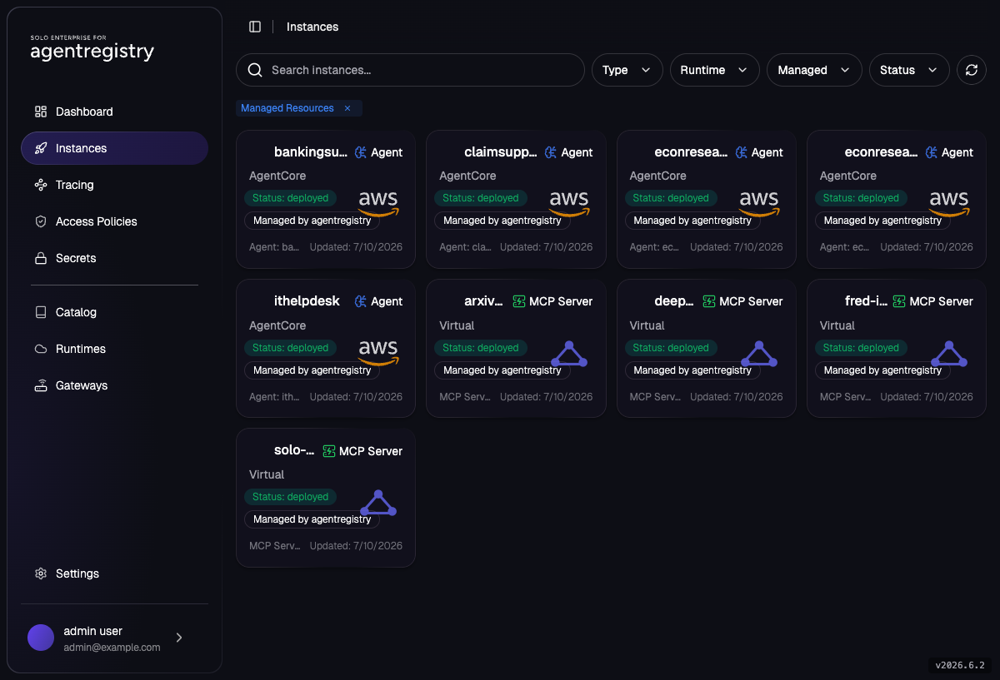
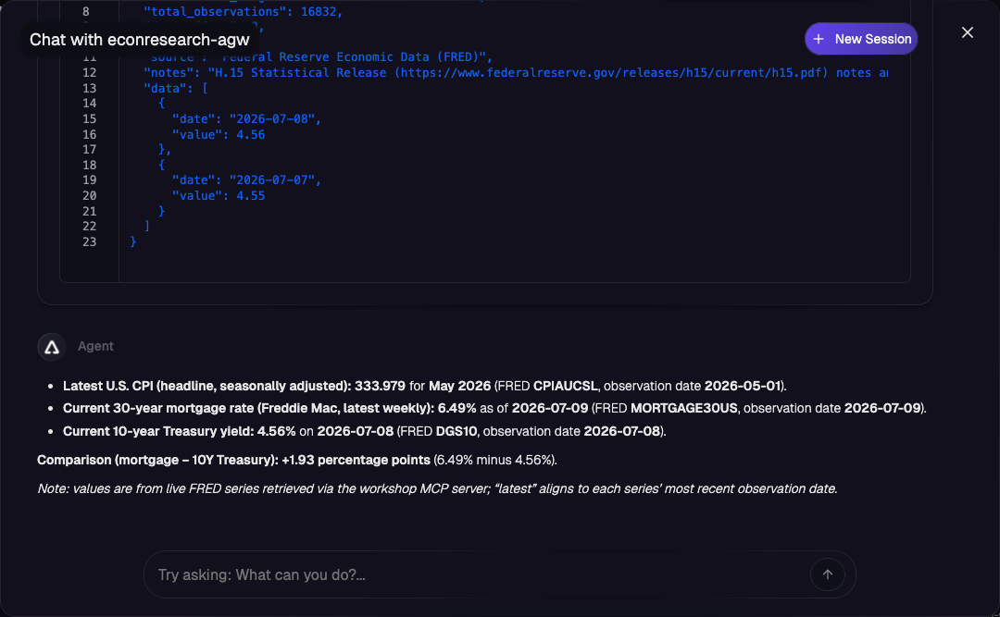

# Route LLM and Registry-Managed MCP Through Agentgateway

> **AWS Bedrock AgentCore series, Part 5 of 5**
> [Part 1: Integrate Agentregistry and AgentCore](agentcore-01-integration.md) ·
> [Part 2: Create Agents](agentcore-02-create-agents.md) ·
> [Part 3: Register and Deploy Agents to AgentCore](agentcore-03-deploy-agents.md) ·
> [Part 4: Approval-Gated Agent Onboarding](agentcore-04-approval-onboarding.md) ·
> **Part 5: Route LLM and Registry-Managed MCP Through Agentgateway** (this lab) ·
> [Cleanup](agentcore-cleanup.md)

In Parts 1–3, `econresearch`'s model calls went straight from AgentCore to Bedrock (SDK + IAM),
and its "data" was an offline snapshot baked into `agent.py`. This lab extends it into
[`econresearch-agw`](../../assets/agents/econresearch-agw/), where **both of the agent's data
planes route through the workshop's in-cluster Agentgateway**:

- **LLM plane:** an OpenAI model (`gpt-5.4-nano`) consumed through a `/openai` gateway route.
  The OpenAI API key lives in a Kubernetes `Secret` next to the gateway; the agent never holds
  it — the gateway injects it upstream.
- **Tool plane:** the real **FRED** (Federal Reserve Economic Data) MCP server from the
  [FRED MCP lab](../mcp/fred-mcp.md), served at `/registry/fred`, attached to the agent via
  `spec.mcpServers`. The offline snapshot is gone; every number is fetched live.

One gateway fronts the model and the tools: one place to hold credentials, observe traffic,
and enforce policy.

```
[ AWS Bedrock AgentCore runtime: econresearch-agw ]
        │                        │
   LLM calls                MCP tool calls
        ▼                        ▼
   /openai  ──────────┐    /registry/fred ─────┐
        [ agentregistry-gateway (in-cluster Agentgateway LB) ]
        │ injects OPENAI_API_KEY          │ routes to mcp-fred pod
        ▼                                 ▼
   api.openai.com                 FRED MCP ──▶ api.stlouisfed.org
```

> **Cost note:** this lab makes OpenAI API calls (your `OPENAI_API_KEY`), FRED API calls
> (free key), and reuses Part 1's AgentCore integration (image build + runtime + CloudWatch,
> small but non-zero). [Cleanup](agentcore-cleanup.md) removes the AWS-side resources.

## Lab Objectives

- Deploy the credentialed FRED MCP server and expose it through Agentgateway (condensed from
  the [FRED MCP lab](../mcp/fred-mcp.md))
- Add an **LLM route** to the same gateway: `Secret` + `AgentgatewayBackend` + `HTTPRoute`,
  verified with a raw `curl` before any agent exists
- Read the `econresearch-agw` agent as a diff against `econresearch`: LiteLLM instead of the
  Bedrock adapter, gateway discovery from `MCP_SERVERS_CONFIG`, live tools instead of snapshot
- Catalog an **agent-facing** FRED entry that carries the gateway URL, publish the agent, and
  deploy it to AgentCore
- Verify answers are grounded in live FRED observations, not a snapshot

## Pre-requisites

- [Part 1](agentcore-01-integration.md) complete and **not cleaned up**: `arctl get runtimes`
  shows `agentcore`.
- A **publicly reachable** Agentgateway LoadBalancer. The agent runs in AWS, so it must be able
  to reach your gateway over the internet. Managed clusters (EKS/GKE/AKS) with a public LB: yes.
  **kind/local clusters: the deploy in section 4 will not work** — you can still read along and
  run sections 1–2. (The production answer for private networking is the registry's managed
  EC2 gateway; see [Next](#next).)
- A **FRED API key** — free, takes about two minutes:
  1. Create a free account (or sign in) at https://fredaccount.stlouisfed.org/login
  2. Open **My Account → API Keys** (https://fredaccount.stlouisfed.org/apikeys) and click
     **Request API Key**
  3. Enter a one-line description of your use (e.g. "workshop demo agent") and submit — the
     32-character key is issued immediately; copy it for the shell context below
  (Details: https://fred.stlouisfed.org/docs/api/api_key.html)
- An **OpenAI API key**: https://platform.openai.com/api-keys
- Shell context (re-run in every new shell):

```bash
export FRED_API_KEY=<your-fred-api-key>
export OPENAI_API_KEY=<your-openai-api-key>   # skip if already in your shell profile

export PATH=$HOME/.arctl/bin:$PATH
source ~/.are-keycloak-env
export AR_IP=$(kubectl get svc agentregistry-enterprise-server -n agentregistry-system \
  -o jsonpath='{.status.loadBalancer.ingress[0].ip}{.status.loadBalancer.ingress[0].hostname}')
export ARCTL_API_BASE_URL="http://${AR_IP}:12121"

export AWS_REGION=us-east-1   # must match the region you used in Part 1
```

> **Security callout:** this lab exposes an **unauthenticated** `/openai` route on a public
> LoadBalancer — anyone who finds the address can spend your OpenAI credits. This is a
> workshop-only posture: tear it down promptly ([Cleanup](agentcore-cleanup.md)), or harden it
> with gateway auth / virtual keys (see [Next](#next)).

## 1. FRED MCP Server Through the Gateway

Condensed from the [FRED MCP lab](../mcp/fred-mcp.md) — **skip to step 1.4 if you've already
done that lab** and `arctl get deployment fred-incluster-agw` shows `DeployedViaAgentgateway`.

### 1.1 Secret + workload

The FRED API key is the MCP server's own config: it lives in a `Secret` next to the workload,
never in the catalog.

```bash
kubectl create namespace mcp
kubectl create secret generic fred-api-key -n mcp \
  --from-literal=FRED_API_KEY="${FRED_API_KEY}"

kubectl apply -f assets/mcp/in-cluster/fred-deployment.yaml
kubectl rollout status deployment/mcp-fred -n mcp
```

### 1.2 Parent Gateway

Shared with the MCP labs — skip if already applied:

```bash
kubectl apply -f assets/mcp/agentgateway/parent-gateway-and-route.yaml
kubectl -n agentgateway-system get gateway agentregistry-gateway -w
# Wait for PROGRAMMED=True + ADDRESS, then Ctrl-C
```

### 1.3 Catalog + deploy via Agentgateway

```bash
arctl apply -f assets/mcp/in-cluster/fred-mcp.yaml
arctl apply -f assets/mcp/in-cluster/fred-mcp-deploy.yaml
sleep 5
arctl get deployment fred-incluster-agw -o yaml | grep -E "reason:|url:"
```

Expect `reason: DeployedViaAgentgateway` and `url: http://<gateway-address>/registry/fred`.

### 1.4 The reachability gate

Capture the gateway address and confirm it's public — this is the go/no-go for section 4:

```bash
export AGW_ADDRESS=$(kubectl -n agentgateway-system get gateway agentregistry-gateway \
  -o jsonpath='{.status.addresses[0].value}')
echo "gateway: ${AGW_ADDRESS}"
```

If `AGW_ADDRESS` is a private IP (`10.*`, `172.16-31.*`, `192.168.*`) or `localhost`, AgentCore
cannot reach it — sections 1–2 still work from your machine, but stop before section 4.

## 2. OpenAI Route on the Same Gateway

### 2.1 Create the credential Secret

Same pattern as FRED: the key lives in a `Secret` in the gateway's namespace, not in the
catalog, not in the agent.

```bash
kubectl create secret generic openai-secret -n agentgateway-system \
  --from-literal=Authorization="${OPENAI_API_KEY}"
```

### 2.2 Backend + route

[`openai-backend-and-route.yaml`](../../assets/mcp/agentgateway/openai-backend-and-route.yaml)
adds an `AgentgatewayBackend` (provider `openai`, auth from the Secret) and an `HTTPRoute` at
`/openai` on the same parent Gateway that serves `/registry/fred`:

```bash
cat assets/mcp/agentgateway/openai-backend-and-route.yaml
kubectl apply -f assets/mcp/agentgateway/openai-backend-and-route.yaml
```

The backend is **unpinned** (`openai: {}`), so the calling agent picks the model. Pinning
`openai.model` at the backend instead turns the gateway into the enforcement point for which
model an organization allows.

### 2.3 Prove it with curl — no agent, no API key on the client

```bash
curl -s -X POST "http://${AGW_ADDRESS}/openai" \
  -H "Content-Type: application/json" \
  -d '{"model":"gpt-5.4-nano","messages":[{"role":"user","content":"Reply with exactly: gateway works"}]}' \
  | jq -r '.choices[0].message.content'
```

Expected:

```
gateway works
```

Note what just happened: the request carried **no** `Authorization` header. The gateway matched
`/openai`, injected the key from `openai-secret`, and proxied to OpenAI. That's the LLM plane
the agent will use. (404 instead? Try `http://${AGW_ADDRESS}/openai/chat/completions` — the
exact path handling depends on the agentgateway version — and use whichever form works as the
mental model for the agent's traffic; the agent's OpenAI client appends `/chat/completions`
to its base URL.)

## 3. The Agent, as a Diff

Open [`econresearch-agw/`](../../assets/agents/econresearch-agw/) next to
[`econresearch/`](../../assets/agents/econresearch/). Three changes:

**The model adapter is gone.** `econresearch` vendored `bedrock_model.py` because LiteLLM's
Bedrock translation drops tool descriptions. The OpenAI path has no such problem, so
`create_model()` is just ADK's built-in wrapper:

```python
return LiteLlm(
    model="openai/gpt-5.4-nano",
    api_base=openai_base_url(),
    api_key=os.environ.get("OPENAI_API_KEY", "gateway-injected"),
)
```

The `api_key` is a placeholder — the gateway injects the real one (section 2).

**Gateway discovery (`gateway.py`).** How does the agent know your gateway's address? It can't
be baked into the source (this folder is cloned from a shared GitHub URL at deploy time), and
AgentCore deployments accept no custom env vars from the registry. But the registry *does*
inject `MCP_SERVERS_CONFIG` — and because `fred-gateway-mcp`'s catalog URL is the gateway's
`/registry/fred` route, the agent can derive its LLM base URL from the MCP config's origin:
`http://<gw>/registry/fred` → `http://<gw>/openai`. The registry already tells the agent where
its gateway is — via the MCP config. (`OPENAI_BASE_URL` overrides this for local runs.)

**Snapshot out, live tools in.** `ECON_SERIES`, `list_series`, and `get_series_latest` are
deleted. The agent's only tools are the FRED MCP server's — `fred_browse`, `fred_search`,
`fred_get_series` — resolved from `agent.yaml`:

```yaml
spec:
  mcpServers:
    - kind: MCPServer
      name: fred-gateway-mcp
```

`fred-gateway-mcp` is a second, *agent-facing* catalog entry you'll create in section 4: a
remote MCPServer whose URL is your gateway's public `/registry/fred` route. Remote MCPServers
are injected into the agent's `MCP_SERVERS_CONFIG` by their **catalog URL** with no extra
deploy-time wiring.

The instruction changes to match: cite series IDs and **observation dates**, disclose the data
is live from FRED — the "demo snapshot" disclaimer is gone.

## 4. Publish and Deploy

> Go/no-go: section 1.4's `AGW_ADDRESS` must be publicly reachable.

### 4.1 Catalog the agent-facing FRED entry

`fred-incluster-mcp` (section 1) is registered by its **cluster-internal** Service URL — right
for gateway routing, useless to an agent running in AWS. Create a second, agent-facing entry
whose URL is the gateway's public route. This is the URL the registry will inject into the
agent's `MCP_SERVERS_CONFIG`:

```bash
arctl apply -f - <<EOF
apiVersion: ar.dev/v1alpha1
kind: MCPServer
metadata:
  name: fred-gateway-mcp
spec:
  description: "FRED (Federal Reserve Economic Data) MCP - agent-facing entry via the Agentgateway public route"
  remote:
    type: streamable-http
    url: "http://${AGW_ADDRESS}/registry/fred"
EOF
```

Note there is still **no credential** here — the FRED key stays in its `Secret` from
section 1.1; this entry only names where agents should call.

> **Why not `deploymentRefs`?** You might expect to link the agent deployment to
> `fred-incluster-agw` via `spec.deploymentRefs` and let the registry resolve the gateway URL.
> As of `v2026.7.0` the registry rejects that with `ErrMCPSetMismatch`: its set-equality
> validation excludes *remote* MCPServers (like `fred-incluster-mcp`, registered by URL) from
> the set `deploymentRefs` may wire, so the ref is treated as an extra. Until that's relaxed
> upstream, the agent-facing catalog entry above is the working pattern; the trade-off is that
> your gateway address lives in a catalog entry you create per-environment.

### 4.2 Publish and deploy the agent

```bash
arctl apply -f assets/agents/econresearch-agw/agent.yaml

arctl apply -f - <<EOF
apiVersion: ar.dev/v1alpha1
kind: Deployment
metadata:
  name: econresearch-agw
spec:
  targetRef:
    kind: Agent
    name: econresearch-agw
    tag: "1.0.0"
  runtimeRef:
    kind: Runtime
    name: agentcore
  runtimeConfig:
    region: ${AWS_REGION}
    workdir: assets/agents/econresearch-agw
EOF

arctl get deployments
```

`econresearch-agw` deploys alongside the Part 3 agents, distinguished by its `AgentCore` platform
badge and `aws` runtime just like the others — the difference is invisible at this level; it
shows up in *how* the agent reaches its model and tools, not in the deploy mechanics:



The Deployment moves `deploying` → `deployed` (clone, dependency install from the agent's
`requirements.txt`, AgentCore rollout — a few minutes, same phases as
[Part 3](agentcore-03-deploy-agents.md)).

> **`requirements.txt`, not the Dockerfile.** On the AgentCore path the registry generates its
> own wrapper and installs Python deps from the agent folder's `requirements.txt` (appending
> its defaults: `kagent-adk`, `google-adk`, `boto3`, …) — the checked-in `Dockerfile` and
> `pyproject.toml` are not consulted. That's why this agent ships a one-line `requirements.txt`
> pinning `litellm`, the only package the defaults don't cover.

## 5. Verify: Live Data, Governed Planes

Open the **Instances** view (`http://${AR_IP}:12121/are/instances/`), select
`econresearch-agw`, and ask:

> What is the latest US CPI reading, and how does the current 30-year mortgage rate compare
> to the 10-year treasury?

Check the answer against Part 3's `econresearch`:

- It cites **recent observation dates** (this month/quarter — live FRED data), not the fixed
  snapshot dates, and no "demo snapshot" disclaimer appears.
- The tool calls are `fred_search` / `fred_get_series`, not `get_series_latest`.



Both planes are now observable in one place. CloudWatch still has the agent's own logs
(Part 3's flow):

```bash
aws logs describe-log-groups --region "${AWS_REGION}" \
  --log-group-name-prefix /aws/bedrock-agentcore/runtimes/
aws logs tail "/aws/bedrock-agentcore/runtimes/<runtime-id>-DEFAULT" \
  --region "${AWS_REGION}" --follow
```

and the gateway sees the LLM and MCP traffic. Note the time, ask the chat question, then filter
the gateway's logs to just the two routes this agent uses — `--tail=50` on its own is too broad
on a shared cluster (other MCP deployments hit the same gateway) to prove the traffic is *yours*:

```bash
kubectl -n agentgateway-system logs deploy/agentregistry-gateway --since=2m \
  | grep -E "route=agentgateway-system/openai-llm|/registry/fred"
```

Expected: one line per LLM call and per MCP tool call, interleaved by timestamp:

```
...route=agentgateway-system/openai-llm ... http.path=/openai/chat/completions ... protocol=llm gen_ai.provider.name=openai gen_ai.request.model=gpt-5.4-nano ... duration=1581ms
...route=agentregistry-system/dep-default-fred-incluster-agw-<hash> ... http.path=/registry/fred ... protocol=mcp mcp.method.name=tools/call gen_ai.tool.name=fred_search mcp.session.id=<id> duration=312ms
...route=agentregistry-system/dep-default-fred-incluster-agw-<hash> ... http.path=/registry/fred ... protocol=mcp mcp.method.name=tools/call gen_ai.tool.name=fred_get_series mcp.session.id=<id> duration=458ms
...route=agentgateway-system/openai-llm ... http.path=/openai/chat/completions ... protocol=llm gen_ai.provider.name=openai gen_ai.request.model=gpt-5.4-nano ... duration=1206ms
```

Two things confirm this is genuinely *your* agent's traffic through the gateway, not noise from
another deployment sharing it:

- Every `/registry/fred` line for one chat turn carries the **same `mcp.session.id`** — one
  session, opened by `econresearch-agw`, making multiple tool calls (`fred_search` to find the
  right series, then `fred_get_series` to read it).
- The `/openai` and `/registry/fred` lines interleave in time (LLM call → tool calls → LLM call
  with the tool results → …), which is the model/tool loop for a single turn, not two unrelated
  agents calling the gateway at the same time.

The `gen_ai.*` fields are themselves useful signal: `gen_ai.usage.input_tokens` /
`output_tokens` / `agw.ai.usage.cost.total` on the LLM lines, and `gen_ai.tool.name` on the MCP
lines, are exactly what you'd want in a real deployment to attribute spend and tool usage per
agent from the gateway alone — without instrumenting the agent itself.

## Troubleshooting

| Symptom | Likely cause / fix |
|---|---|
| curl in 2.3 returns 401/`invalid_api_key` | `openai-secret` wrong or missing: recreate it from `$OPENAI_API_KEY` (2.1) and re-check. The key must be under the `Authorization` key of the Secret. |
| curl in 2.3 returns 404 | Route/path mismatch: confirm the HTTPRoute is `Accepted` (`kubectl -n agentgateway-system describe httproute openai-llm`) and try the `/openai/chat/completions` form. |
| curl in 2.3 rejects the model name | Backend pinned to a different model: unpin (`openai: {}`) or match the pinned name. |
| Agent deploys but replies with connection errors to the LLM | The gateway isn't reachable *from AWS*: re-check section 1.4 — a private LB address works from your laptop but not from AgentCore. |
| Deploy fails with `ErrMCPSetMismatch` mentioning an MCP that *is* declared | You added `deploymentRefs` — the registry excludes remote MCPServers from the set `deploymentRefs` may wire, so the ref counts as extra (see the note in 4.1). Drop `deploymentRefs`; the remote `fred-gateway-mcp` entry needs none. |
| Agent has no FRED tools (answers from memory or refuses) | MCP wiring: `spec.mcpServers` names `fred-gateway-mcp` in the published agent (`arctl get agent econresearch-agw -o yaml`), and that catalog entry's `remote.url` is your gateway's public `/registry/fred` (4.1). |
| Agent crashes at startup with `cannot determine the agentgateway LLM base URL` | `MCP_SERVERS_CONFIG` wasn't injected — same MCP-wiring checks as above; the LLM base URL is derived from it. |
| First chat fails with `Fail to load 'econresearch_agw' module. LiteLLM support requires...` | The image was built without `litellm`. The deploy log's "Final requirements.txt" (visible in the Instances view's Logs panel) shows exactly what the builder installed — if it's only the auto-generated `kagent-adk`/`google-adk`/etc. defaults with no `litellm` line, the builder never saw your checked-in `requirements.txt` at all. This isn't necessarily a local file problem: `agent.yaml`'s `source.repository` clones a specific **branch on GitHub**, not your working tree, so if `requirements.txt` was added in a commit that hasn't been pushed to that branch yet, the clone predates the file. Confirm with `git log <branch> -- <subfolder>/requirements.txt` against the remote, push/merge if needed, then `arctl delete deployment <name>` + re-`apply` to force a fresh clone and build (re-`apply`-ing the same Deployment spec unchanged does not retrigger a rebuild). |
| FRED `tools/list` works but `tools/call` fails | FRED credential problem, not connectivity: check the `fred-api-key` Secret (see the [FRED MCP lab](../mcp/fred-mcp.md)). |

## Cleanup

See the
["If you completed Part 5"](agentcore-cleanup.md#if-you-completed-part-5-llm-and-mcp-through-agentgateway)
section of the consolidated [Cleanup](agentcore-cleanup.md) guide to remove the agent, the OpenAI
route, and the FRED resources this lab created. Do that before tearing down Part 1's integration
— a Deployment can't outlive the Runtime it targets.

## Summary

Both of `econresearch`'s data planes now route through the same in-cluster Agentgateway instead
of going direct:

- **Tool plane:** the real FRED MCP server, deployed and exposed at `/registry/fred` — the
  offline snapshot is gone, every number is a live observation.
- **LLM plane:** an OpenAI backend behind `/openai`, with the API key living in a `Secret` next
  to the gateway and injected upstream — the agent never holds it.
- **The agent as a diff:** `econresearch-agw` swaps the Bedrock adapter for ADK's built-in
  LiteLLM wrapper, derives its gateway address from the injected `MCP_SERVERS_CONFIG` instead of
  a baked-in URL, and drops the snapshot tools for the FRED MCP's live ones.
- **Catalog + deploy:** a second, agent-facing `fred-gateway-mcp` entry (registered by the
  gateway's public URL, since `deploymentRefs` can't resolve a remote MCPServer today) let the
  registry publish and deploy the agent to AgentCore unchanged from Part 3's flow.
- **Verified:** answers cite current observation dates and use `fred_search`/`fred_get_series`,
  confirming the agent is grounded in live data — and both the LLM and MCP traffic are visible
  in the same gateway log stream, one place to observe and govern everything the agent calls out
  to.
